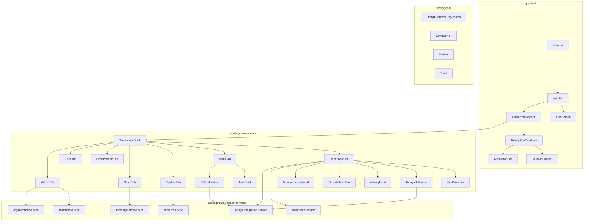

# Design Document: App UI Overhaul

## Overview

This design covers the comprehensive UI/UX overhaul of the AdminI web application, aligning the visual layer and interaction model to the Figma design mock. The overhaul touches every major application area: Dashboard, Tasks, Capture, Notes, Observations, Pulse, Admin, and the shared design system.

The approach is a presentation-layer rewrite. Existing service layers (`dashboardService`, `googleIntegrationService`, `captureService`, etc.) and data models remain stable. The overhaul rewrites component markup, CSS, and interaction patterns while preserving the data-fetching and business-logic contracts already in place.

### Key Design Decisions

1. **CSS Custom Properties as the design token layer** — All colors, spacing, radii, and typography are expressed as CSS custom properties in `@admini/ui/styles.css`. Components consume tokens, never hard-code values.
2. **Component-per-file with co-located CSS** — Each new or refactored component gets a dedicated `.css` file in `packages/workspace/src/styles/`. No inline styles.
3. **Responsive breakpoint at 900px** — Below 900px the two-column Dashboard collapses to a single column, and the sidebar hides in favor of a mobile tab bar.
4. **Dark mode limited to auth screens** — The `[data-theme='dark']` scope applies only to `AuthScreen.tsx` and its styles. The main workspace always renders in light mode.
5. **No new runtime dependencies** — The overhaul uses React 18, TypeScript, Vite, and existing packages. No additional UI framework.

## Architecture



### Architectural Layers

| Layer | Package | Responsibility |
|-------|---------|---------------|
| Design Tokens | `@admini/ui` | CSS custom properties, base component classes |
| Layout Shell | `@admini/ui` | Viewport-adaptive shell (sidebar vs. tab bar) |
| Feature Components | `@admini/workspace` | Tab views, modals, widgets |
| Services | `@admini/workspace/services` | Supabase queries, Google API calls, localStorage |
| API Workers | `workers/` | Cloudflare Workers for email (Resend), AI tasks |

## Components and Interfaces

### Design System Tokens (Updated)

The existing `styles.css` token set is updated to match the Figma mock:

| Token | Current Value | New Value | Purpose |
|-------|--------------|-----------|---------|
| `--color-sage` | `#87a878` | `#6B8E6B` | Primary accent (Sage Green) |
| `--color-sage-deep` | `#54745c` | `#4A6B4A` | Hover/pressed state |
| `--color-bg` | `#f9f8f6` | `#F5F3EE` | Page background (Limestone) |
| `--color-surface` | `#ffffff` | `#FFFFFF` | Card background (unchanged) |
| `--color-category-orange` | — (new) | `#E8A838` | Compliance category |
| `--color-category-yellow` | — (new) | `#E6C84D` | Scheduling category |
| `--color-category-green` | — (new) | `#7BAF7B` | Students category |
| `--color-category-red` | — (new) | `#D63031` | Blocked/stale indicator |

Typography tokens remain system fonts (`--font-body`). The `Tomorrow` display font is retained only for headings.

### Component Hierarchy

#### DashboardTab (Refactored)

```typescript
interface DashboardTabProps {
  userName: string;
  userId?: string;
  organizationId?: string;
  onTabChange?: (tabId: WorkspaceTab) => void;
}
```

Sub-components extracted from the monolithic DashboardTab:

- **QuickActionsBar** — Renders pill buttons, emits navigation events
- **LevelBadge** — Displays level/badge count, opens AchievementsModal on click
- **AchievementsModal** — Overlay with earned/locked badges and progress bar
- **MiniCalendar** — Month grid with navigation, today highlight, task-day dots
- **TodaysSchedule** — Day Structure blocks with inline calendar events
- **ActivityFeed** — Reverse-chronological list (max 7 items)
- **TaskSection** — Reusable card for High Priority / Due Today / Coming Due / Blocked / Suggested

#### TasksTab (Refactored)

```typescript
interface TasksTabProps {
  organizationId?: string;
  onTabChange?: (tabId: WorkspaceTab) => void;
  initialView?: 'list' | 'calendar';
}
```

Sub-components:
- **TaskCard** — Collapsible card with subtask checkboxes, priority indicator, category tag
- **TaskFilterBar** — Filter pills: All, Open, In Progress, Completed, Blocked
- **CalendarView** — Monthly grid overlay of tasks + Google Calendar events + legend
- **OverdueList** — Sidebar list of overdue tasks

#### CaptureTab (Refactored)

```typescript
interface CaptureTabProps {
  initialMode?: 'voice' | 'tap';
  organizationId?: string;
}
```

- Voice and tap modes only (notes functionality moved to NotesTab)
- Unified "Where" field replacing separate Domain/Group fields
- AI summary generation via Cloudflare Worker
- "Create Task from Capture" modal

#### NotesTab (Standalone)

```typescript
interface NotesTabProps {
  organizationId?: string;
  userId?: string;
}
```

- Meeting type selector (dropdown)
- Date and Attendees fields
- Rich text toolbar: Bold, Italic, List, Task checkbox, Divider
- AI-powered "Create Task from Note" action

#### ObservationsTab (Refactored)

```typescript
interface ObservationsTabProps {
  organizationId?: string;
  userId?: string;
}
```

- Role-gated (admin/principal only)
- Observation list with status indicators
- AI-powered "Create Task from Observation" with email-share default
- Gmail share with contact autocomplete

#### PulseTab (Unchanged Interface)

- Day Structure editor: period name, time range, activities
- Cadence management (always active, no "disabled" option)

#### AdminTab (Extended)

```typescript
interface AdminTabProps {
  organizationId?: string;
  userRole: AdminiRole;
}
```

- Staff invitation form (Resend integration)
- Staff roster with role management
- Pending invitations list (persisted via Supabase)
- Google Classroom roster display
- Membership account management
- School name editing
- Roster upload (CSV/Excel)

#### DesktopSidebar (Refactored)

```typescript
interface DesktopSidebarProps {
  activeTab: WorkspaceTab;
  tabs: TabItem[];
  userRole: AdminiRole;
  onTabChange: (tabId: WorkspaceTab) => void;
  onSignOut?: () => void;
}
```

- Brand text "AdminI." at top
- Tab order: Capture, Dashboard, Tasks, Notes, Observations, Pulse, Settings, Admin
- Active tab highlighted with Sage Green background
- Admin/Observations hidden for non-admin/principal roles

#### Toast (Fixed)

- Visible dismiss button with proper `pointer-events`
- De-duplicated toast messages on undo actions

### Shared Utilities

#### `parseLocalDate(dateStr: string): Date`

Parses date strings by splitting on `'T'` and using only the date portion to prevent timezone offset issues. Already exists in `DashboardTab.tsx` — will be extracted to `@admini/shared`.

#### `getTimeGreeting(): string`

Returns time-appropriate greeting. Already exists — will be extracted to `@admini/shared`.

#### `formatActivityAction(event: ActivityEvent): string`

Formats activity events into readable strings. Will be extracted to `@admini/shared`.

#### `isLocalDate(a: string, b: string): boolean`

Compares two date strings using local date comparison (year, month, day) without UTC conversion.

#### `filterTodayEvents(events: CalendarEvent[]): CalendarEvent[]`

Filters calendar events to only those occurring on the current local date, excluding future-dated events.

## Data Models

### Existing Models (No Changes)

The following types from `packages/workspace/src/types.ts` remain unchanged:

- `WorkspaceTab` — Tab identification union type
- `AdminiRole` — User role union
- `DashboardTask` — Task entity
- `DashboardKPIs` — Dashboard KPI summary
- `ActivityEvent` — Sync event
- `OrgDetails`, `OrgMember`, `OrgInvitation` — Organization entities
- `AuthUser` — Minimal auth user shape

### New/Extended Models

```typescript
// Category tag configuration
interface CategoryTag {
  id: string;
  label: string;
  color: 'orange' | 'yellow' | 'green' | 'red';
}

// Extended task with subtasks and blocking info
interface TaskWithSubtasks extends DashboardTask {
  subtasks: Subtask[];
  category?: CategoryTag;
  blockReason?: string;
  staleDays?: number;
}

interface Subtask {
  id: string;
  title: string;
  completed: boolean;
  dueAt?: string;
}

// Day Structure for Pulse
interface DayStructureBlock {
  id: string;
  period: string;          // "Morning", "Afternoon", "End of Day"
  startTime: string;       // "08:00"
  endTime: string;         // "12:00"
  activities: DayActivity[];
}

interface DayActivity {
  label: string;
  type: 'focus' | 'meetings' | 'wrap-up' | 'custom';
}

// Meeting note
interface MeetingNote {
  id: string;
  organizationId: string;
  createdBy: string;
  meetingType: MeetingType;
  date: string;
  attendees: string[];
  content: string;          // Rich text HTML
  createdAt: string;
  updatedAt: string;
}

type MeetingType =
  | 'observation-conference'
  | 'staff-meeting'
  | 'teacher-meeting'
  | 'parent-meeting'
  | 'student-meeting'
  | 'disciplinary-incident';

// Capture models (tap mode)
interface TapCategory {
  id: string;
  label: string;
  icon?: string;
  organizationId: string;
}

interface CaptureRecord {
  id: string;
  mode: 'voice' | 'tap';
  content: string;
  summary?: string;          // AI-generated
  where?: string;            // Unified location
  category?: TapCategory;
  createdAt: string;
  organizationId: string;
  createdBy: string;
}

// Badge/Achievement
interface Badge {
  id: string;
  icon: string;
  label: string;
  description: string;
  earnedAt?: string;         // undefined = locked
}

// Local calendar event
interface LocalEvent {
  id: string;
  summary: string;
  start: string;             // ISO date or datetime
  end: string;
}
```


## Correctness Properties

*A property is a characteristic or behavior that should hold true across all valid executions of a system - essentially, a formal statement about what the system should do. Properties serve as the bridge between human-readable specifications and machine-verifiable correctness guarantees.*

### Property 1: Time greeting correctness

*For any* hour value (0-23), `getTimeGreeting()` SHALL return "Good morning" for hours 5-11, "Good afternoon" for hours 12-17, and "Good evening" for hours 18-4, with no gaps or overlaps in the hour ranges.

**Validates: Requirements 1.1**

### Property 2: Stale days calculation

*For any* task with an `updatedAt` date in the past, the computed `staleDays` value SHALL equal the number of calendar days between `updatedAt` (parsed as local date) and today's local date, and SHALL always be non-negative.

**Validates: Requirements 1.6**

### Property 3: Role-gating hides restricted navigation

*For any* user role that is not `admin` or `principal`, the sidebar and tab bar SHALL exclude the Admin and Observations navigation items from the rendered output.

**Validates: Requirements 4.4, 19.5**

### Property 4: Mini calendar task-day indicators

*For any* set of tasks with due dates within the displayed month, the Mini Calendar SHALL show a dot indicator on exactly those dates that have at least one task due, and no dot on dates without tasks.

**Validates: Requirements 5.3**

### Property 5: Event-to-time-block placement

*For any* calendar event with a start time, the event SHALL be placed within the time block whose start/end range contains that event's start hour, and SHALL not appear in any other time block.

**Validates: Requirements 6.2**

### Property 6: Today's events filter

*For any* set of calendar events with various dates, `filterTodayEvents` SHALL return only events whose local date portion matches today's local date, excluding all future-dated and past-dated events.

**Validates: Requirements 6.3, 6.5, 18.3**

### Property 7: Local event delete button visibility

*For any* event displayed in Today's Schedule, a delete button SHALL be rendered if and only if the event is a local event (ID does not originate from Google Calendar).

**Validates: Requirements 6.4**

### Property 8: Activity feed ordering and limit

*For any* list of activity events, the Activity Feed SHALL display at most 7 items, and those items SHALL be sorted in strictly non-increasing order by `createdAt` timestamp.

**Validates: Requirements 7.1**

### Property 9: Subtask completion gates parent task

*For any* task with at least one subtask where `completed` is false, the parent task's completion checkbox SHALL be disabled or prevented from being checked.

**Validates: Requirements 8.4**

### Property 10: Overdue task identification

*For any* task whose local due date is before today's local date and whose status is not `completed`, that task SHALL appear in the overdue task list.

**Validates: Requirements 9.3**

### Property 11: Event merge completeness

*For any* set of Google Calendar events and local events, the merged result SHALL contain every event from both sources, with the combined length equal to the sum of both input lengths (no items lost or duplicated).

**Validates: Requirements 13.2**

### Property 12: Toast deduplication

*For any* sequence of rapid undo action triggers, the number of simultaneously visible toast notifications SHALL never exceed one.

**Validates: Requirements 17.3**

### Property 13: Local date parsing preserves calendar day

*For any* valid date string in ISO format (with or without a time component), `parseLocalDate` SHALL produce a Date object whose `getFullYear()`, `getMonth()`, and `getDate()` match the year, month, and day digits in the original string, regardless of the runtime timezone offset.

**Validates: Requirements 18.1, 18.2**

## Error Handling

### Google Calendar API Failures

When the Google Calendar token is missing or the API call fails, the system gracefully degrades:
- `getTodayCalendarEvents()` and `getCalendarEvents()` return empty arrays on failure
- All calendar-related views fall back to displaying only local events
- No error banner or blocking modal is shown - the rest of the view remains functional

### Supabase Data Fetch Errors

- `DashboardTab` shows an error banner with a "Retry" button when task/event/KPI fetching fails
- Individual service functions (`getTasks`, `getActivityEvents`) throw errors that components catch and surface appropriately
- Network failures do not crash the application - each data section degrades independently

### localStorage Failures

- All `localStorage` reads are wrapped in try/catch blocks returning sensible defaults (empty arrays, null)
- If localStorage is unavailable (private browsing), the application functions with defaults and does not persist user preferences

### Invalid Date Strings

- `parseLocalDate` handles edge cases by splitting on `'T'` - if no `'T'` is present, the full string is treated as a date
- NaN results from malformed date strings are handled by downstream display functions (showing empty or "No date")

### Role-Based Access

- Components check `userRole` before rendering restricted content
- If role data is unavailable, the system defaults to the most restrictive view (teacher role), hiding Admin and Observations

### Toast Error Prevention

- Toast manager deduplicates messages by tracking the current visible toast ID
- If a toast dismiss is triggered while an undo is in progress, the undo completes before the toast unmounts

## Testing Strategy

### Testing Approach

This feature uses a **dual testing strategy**:

1. **Unit tests (example-based)** - Verify specific UI rendering, interactions, navigation, and edge cases
2. **Property-based tests** - Verify universal properties of pure functions and data transformations using `fast-check`

The project already uses Vitest with jsdom. Property tests use the `fast-check` library (already available via the existing `recommendationEngine.property.test.ts` pattern).

### Property-Based Tests

Each correctness property above maps to a single property-based test with a minimum of 100 iterations.

**Library:** `fast-check` (compatible with Vitest)

**Test file locations:**
- `packages/shared/src/__tests__/dateUtils.property.test.ts` - Properties 2, 6, 13
- `packages/workspace/src/components/__tests__/Dashboard.property.test.ts` - Properties 1, 4, 5, 8
- `packages/workspace/src/components/__tests__/Navigation.property.test.ts` - Properties 3, 7
- `packages/workspace/src/components/__tests__/Tasks.property.test.ts` - Properties 9, 10
- `packages/workspace/src/components/__tests__/Toast.property.test.ts` - Property 12
- `packages/workspace/src/services/__tests__/googleIntegration.property.test.ts` - Property 11

**Tag format:** Each test includes a comment:
```typescript
// Feature: app-ui-overhaul, Property 1: Time greeting correctness
```

**Configuration:** Each property test runs with `{ numRuns: 100 }` minimum.

### Unit Tests (Example-Based)

Unit tests cover:
- **UI structure:** Verify correct sections, buttons, labels render (Requirements 1.2, 1.3, 2.1, 4.1, 4.2, etc.)
- **Interactions:** Click handlers trigger correct navigation (Requirements 2.2-2.5, 3.1, 3.5, 5.4)
- **Responsive layout:** Viewport-based rendering (Requirement 1.4)
- **Role gating:** Component visibility by role (covered by property + examples)
- **Edge cases:** Empty states, missing data, localStorage unavailable (Requirements 7.3, 13.3)

**Test file locations:**
- `packages/workspace/src/components/__tests__/DashboardTab.test.tsx`
- `packages/workspace/src/components/__tests__/TasksTab.test.tsx`
- `packages/workspace/src/components/__tests__/CaptureTab.test.tsx`
- `packages/workspace/src/components/__tests__/NotesTab.test.tsx`
- `packages/workspace/src/components/__tests__/AdminTab.test.tsx`
- `packages/workspace/src/components/__tests__/Toast.test.tsx`
- `packages/workspace/src/components/__tests__/DesktopSidebar.test.tsx`

### Integration Tests

Integration tests verify cross-component flows:
- Day Structure update in Pulse reflected in Dashboard Today's Schedule (Requirement 12.3)
- Google Calendar data appears across Dashboard, Tasks Calendar, Mini Calendar (Requirement 13.1)
- Task creation from Capture/Notes/Observations triggers AI service (Requirements 10.5, 11.6, 19.2)
- Notification sent on task assignment (Requirement 14.1)

### CSS/Visual Verification

- Design token values verified via smoke tests (computed style checks for `--color-sage`, `--color-bg`)
- Dark mode scope limited to auth screens verified by absence of `[data-theme='dark']` on workspace root
