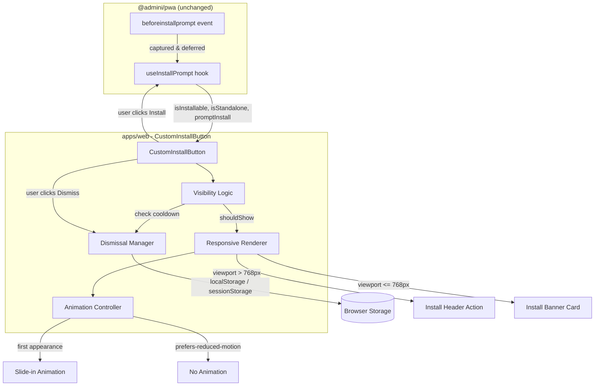

# Design Document: Custom Install Button

## Overview

This feature introduces a branded, context-aware PWA install button (`CustomInstallButton`) that replaces the generic `InstallButton` from `@admini/pwa`. The custom component consumes the existing `useInstallPrompt` hook without modifying the package source, adding responsive placement logic (desktop header action vs. mobile banner), user dismissal persistence with a 30-day cooldown, entrance animation on first appearance, and permanent removal in standalone mode.

## Architecture



## Components and Interfaces

### CustomInstallButton (React Component)

```typescript
// apps/web/src/components/CustomInstallButton.tsx
export function CustomInstallButton(): React.ReactElement | null;
```

**Props:** None (self-contained; consumes context via hooks)

**Internal Hooks:**

```typescript
// Dismissal management with localStorage + fallback
function useDismissal(): {
  isDismissed: boolean;
  dismiss: () => void;
};

// First-appearance tracking for animation
function useIsFirstAppearance(shouldShow: boolean): boolean;

// Responsive layout mode detection
function useResponsiveMode(): 'desktop' | 'mobile';
```

**Consumed from `@admini/pwa`:**

```typescript
import { useInstallPrompt } from '@admini/pwa';
// Returns: { isInstallable: boolean; isStandalone: boolean; promptInstall: () => Promise<'accepted' | 'dismissed'> }
```

### CSS Module

```
// apps/web/src/components/CustomInstallButton.css
.custom-install-button              - base container
.custom-install-button--desktop     - header action variant
.custom-install-button--mobile      - banner card variant
.custom-install-button--animate-in  - entrance animation
.custom-install-button__install-btn - primary install action
.custom-install-button__dismiss-btn - dismiss/close action
.custom-install-button__icon        - download icon wrapper
```

## Data Models

### Dismissal Record (localStorage)

```typescript
interface DismissalRecord {
  /** Unix timestamp (ms) of when the user last dismissed the prompt */
  timestamp: number;
}
```

**Storage Key:** `admini_install_dismissed`

**Lifecycle:**
- Created on dismiss action with `Date.now()`
- Read on component mount to determine visibility
- Expires after 30 days (2,592,000,000 ms)
- Deleted/ignored if JSON parse fails

### Animation Flag (sessionStorage)

**Storage Key:** `admini_install_animated`

**Value:** `"1"` (present = already animated this session)

**Lifecycle:**
- Set after first entrance animation plays
- Read on component mount to skip animation on re-renders
- Automatically cleared when browser session ends

## Component Structure

```
apps/web/src/components/
+-- CustomInstallButton.tsx        # Main component
+-- CustomInstallButton.css        # Styles using @admini/ui tokens
+-- __tests__/
    +-- CustomInstallButton.test.tsx
```

### CustomInstallButton.tsx

Single component file containing:

- **Root component** (`CustomInstallButton`) - orchestrates visibility, layout mode, and animation
- **useDismissal hook** (internal) - encapsulates localStorage read/write with 30-day cooldown and fallback logic
- **useIsFirstAppearance hook** (internal) - tracks whether this is the first render in the session (for animation)

## Data Flow

```
Mount
  +- useInstallPrompt() -> { isInstallable, isStandalone, promptInstall }
  +- If isStandalone -> return null (skip all logic)
  +- useDismissal() -> { isDismissed, dismiss }
  |   +- Read localStorage key 'admini_install_dismissed'
  |   +- Parse timestamp, compare to Date.now() - 30 days
  |   +- If localStorage throws -> fallback to useState (session-only)
  +- Compute shouldShow = isInstallable AND NOT isDismissed AND NOT isStandalone
  +- If NOT shouldShow -> return null
  +- useResponsiveMode() -> 'desktop' | 'mobile' (768px breakpoint via matchMedia)
  +- Render appropriate variant with entrance animation on first appearance

User Actions:
  Install click -> promptInstall() -> hook hides button (isInstallable -> false)
  Dismiss click -> dismiss() -> writes timestamp to localStorage -> component hides
```

## CSS Approach

All styles in `CustomInstallButton.css` use existing `@admini/ui` CSS custom properties:

| Token | Usage |
|-------|-------|
| `--color-primary` | Install button background |
| `--color-primary-strong` | Install button hover state |
| `--color-surface` | Banner card background |
| `--color-border` | Card/button border |
| `--color-text` | Button text color (mobile banner) |
| `--color-text-muted` | "Not now" dismiss text |
| `--font-body` | All text |
| `--font-weight-medium` | Button text weight |
| `--radius-md` | Button border-radius |
| `--radius-card` | Banner card border-radius |
| `--shadow-soft` | Banner card shadow |
| `--transition-fast` | Hover/focus transitions |
| `--transition-normal` | Layout transitions |
| `--space-sm`, `--space-md`, `--space-lg` | Padding and gaps |

This ensures automatic light/dark theme support via the existing `[data-theme]` mechanism.

## Responsive Behavior

### Desktop (viewport > 768px) - Install Header Action

- Rendered as a compact inline button in the app toolbar/header area
- Uses `admini-button primary` styling pattern
- Sits in a designated slot that does not displace existing toolbar actions
- Dismiss control appears as a small X icon or "Not now" text to the right

### Mobile (viewport <= 768px) - Install Banner Card

- Rendered as a fixed-position card/banner above the bottom tab bar
- Uses `admini-card` styling pattern with brand accent
- Positioned with `bottom` calculated to clear the tab bar (`bottom: calc(60px + env(safe-area-inset-bottom))`)
- Full-width with horizontal padding, containing both install and dismiss actions
- Does not overlap primary navigation

### Resize Handling

- Uses `window.matchMedia('(max-width: 768px)')` with a `change` listener
- State-driven rendering (no unmount/remount) - component stays mounted, CSS class toggles placement
- Matches the same 768px breakpoint used by `LayoutShell` in the existing workspace

## Dismissal Storage

**Key:** `admini_install_dismissed`

**Value:** JSON string `{ "timestamp": <number> }`

**Logic:**

1. On mount, read and parse the stored value
2. If `Date.now() - timestamp < 30 * 24 * 60 * 60 * 1000` -> mark as dismissed
3. If expired or missing -> allow rendering
4. On dismiss action, write `{ "timestamp": Date.now() }` and hide immediately

**Error Handling:**

- Wrap all localStorage access in try/catch
- If any operation throws (private browsing, quota, security policy), fall back to React state (`useState(false)`)
- Session-only fallback means the button reappears on next page load but does not crash

## Standalone Detection

- Consumes `isStandalone` directly from `useInstallPrompt()` return value
- When `isStandalone` is `true`, component returns `null` immediately - no storage reads, no DOM output
- The hook already listens for `display-mode: standalone` media query changes, so mid-session installs are handled automatically without additional logic in this component

## Animation

### Entrance Animation

```css
@keyframes install-button-slide-in {
  from {
    opacity: 0;
    transform: translateY(12px);
  }
  to {
    opacity: 1;
    transform: translateY(0);
  }
}

.custom-install-button--animate-in {
  animation: install-button-slide-in 400ms ease forwards;
}
```

### First Appearance Tracking

- A `sessionStorage` flag (`admini_install_animated`) tracks whether animation has already played
- On first render where `shouldShow` becomes `true` and flag is absent -> apply animation class and set flag
- On subsequent appearances in same session -> render without animation class

### Reduced Motion

```css
@media (prefers-reduced-motion: reduce) {
  .custom-install-button--animate-in {
    animation: none;
    opacity: 1;
    transform: none;
  }
}
```

## Error Handling

| Scenario | Behavior |
|----------|----------|
| localStorage unavailable | Session-only dismissal via React state |
| localStorage quota exceeded | Same as above - catch and degrade |
| JSON parse error on stored value | Treat as no dismissal record |
| `useInstallPrompt` returns unexpected values | Defensive checks; default to hidden |
| sessionStorage unavailable (animation flag) | Always animate (harmless default) |

## Correctness Properties

### Property 1: Visibility invariant
The component renders if and only if `isInstallable === true AND isStandalone === false AND isDismissed === false`.
**Validates: Requirements 1.1, 1.2, 1.3**

### Property 2: Dismissal durability
After dismiss is called, `isDismissed` remains `true` for exactly 30 days (2,592,000,000 ms from the stored timestamp).
**Validates: Requirements 3.2, 3.3**

### Property 3: Cooldown expiry
After 30 days elapsed, a previously dismissed button becomes visible again (given `isInstallable` is still true).
**Validates: Requirements 3.4**

### Property 4: Standalone exclusivity
When `isStandalone` is true, no DOM nodes are rendered and no localStorage reads occur.
**Validates: Requirements 6.1, 6.3, 6.4**

### Property 5: Responsive consistency
The component never unmounts during a viewport resize across the 768px breakpoint; only CSS classes change.
**Validates: Requirements 4.3**

### Property 6: Animation idempotence
The entrance animation plays at most once per browser session.
**Validates: Requirements 2.3, 2.4**

### Property 7: Fallback safety
If localStorage throws on any operation, the component still renders correctly using session-only state (no uncaught exceptions).
**Validates: Requirements 3.5**

### Property 8: Accessibility completeness
Both interactive controls (install, dismiss) have distinct aria-labels and are keyboard-activatable.
**Validates: Requirements 5.1, 5.2, 5.3**

## Testing Strategy

### Unit Tests (Vitest + Testing Library)

1. **Visibility logic** - renders when installable + not dismissed + not standalone; hides otherwise
2. **Dismissal** - click "Not now" stores timestamp; component hides; reappears after 30 days
3. **localStorage fallback** - mock localStorage to throw; verify session-only behavior
4. **Responsive rendering** - mock matchMedia; verify desktop vs mobile class application
5. **Animation** - verify animation class on first appearance; absent on subsequent
6. **Reduced motion** - mock matchMedia for `prefers-reduced-motion`; verify no animation class or CSS handles it
7. **Standalone** - when `isStandalone: true`, component returns null
8. **Accessibility** - verify aria-labels, keyboard activation, live region announcements

### Integration Tests

1. **Install flow** - click install -> `promptInstall` called -> button disappears
2. **Layout integration** - CustomInstallButton in UnifiedWorkspace renders in correct position
3. **Theme support** - component respects light/dark token values

### Manual Testing Checklist

- Chrome DevTools device emulation for responsive breakpoint
- Lighthouse PWA audit
- Screen reader testing (VoiceOver / NVDA)
- `prefers-reduced-motion` system setting toggle
- Private/incognito mode (localStorage restrictions)

