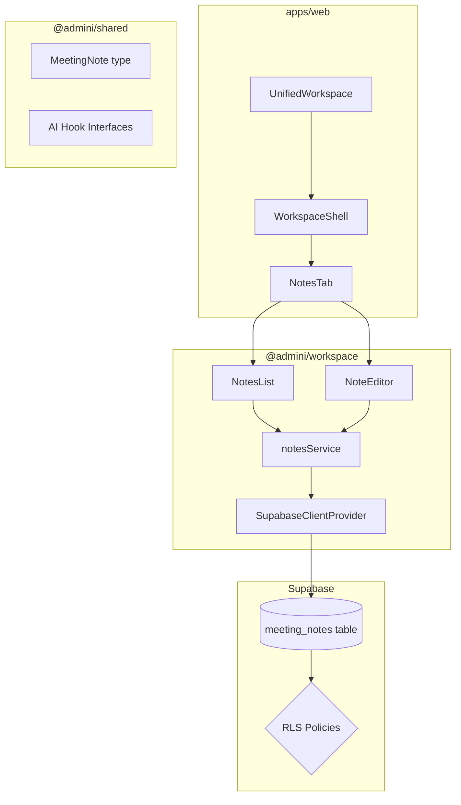
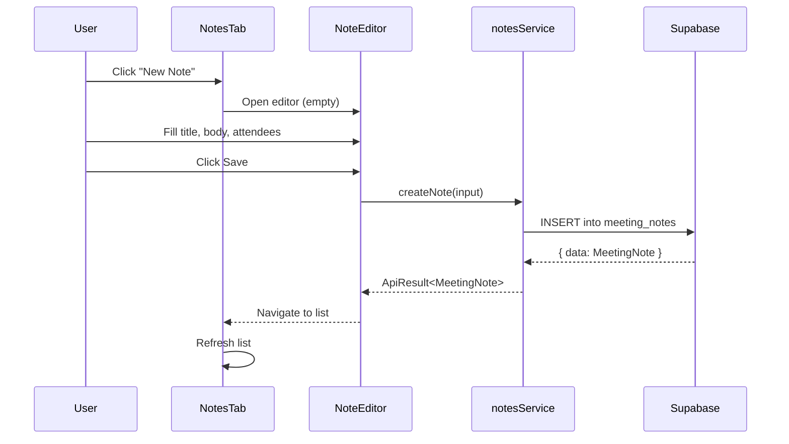
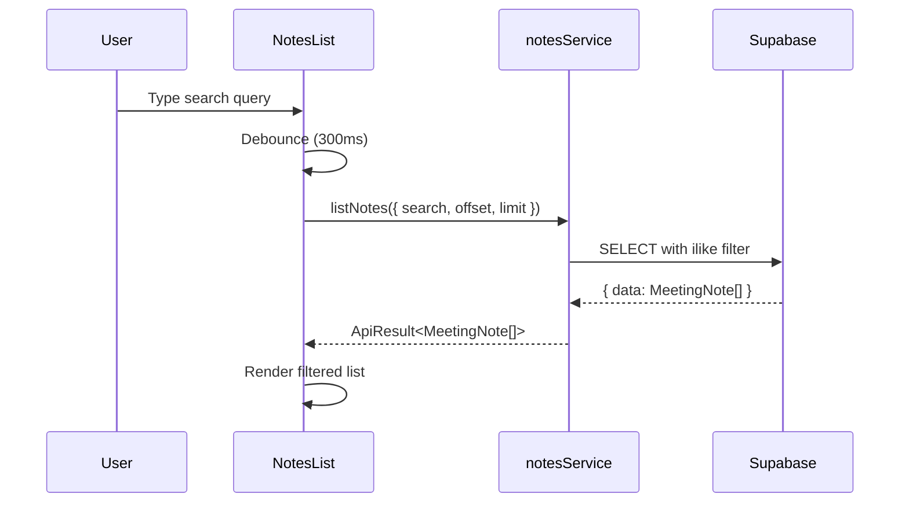

# Design Document: Meeting Notes

## Overview

The Meeting Notes feature adds a "Notes" tab to the AdminI workspace, enabling users to create, edit, and delete meeting notes scoped to their organization. Each note includes a title, timestamp, attendees list (optional), and a rich text body. The feature integrates with the existing tab-based workspace navigation managed by `WorkspaceShell` from `@admini/workspace`, persists data in Supabase with RLS policies, and scaffolds interfaces for future AI-powered smart summaries and task extraction.

The design follows the existing monorepo patterns: shared types in `@admini/shared`, UI primitives in `@admini/ui`, workspace tab registration in `@admini/workspace`, and Supabase queries accessed via the `SupabaseClientProvider` context.

## Architecture



## Sequence Diagrams

### Create a Note



### Search/Filter Notes



## Components and Interfaces

### Component 1: NotesTab

**Purpose**: Top-level tab component registered in WorkspaceShell. Manages view state between the list and editor views.

```typescript
interface NotesTabProps {
  organizationId: string;
}

type NotesView = 
  | { mode: 'list' }
  | { mode: 'create' }
  | { mode: 'edit'; noteId: string };
```

**Responsibilities**:
- Render the correct sub-view based on internal navigation state
- Pass organization context to child components
- Handle transitions between list, create, and edit views

### Component 2: NotesList

**Purpose**: Displays a searchable, filterable list of meeting notes for the current organization.

```typescript
interface NotesListProps {
  organizationId: string;
  onCreateNote: () => void;
  onEditNote: (noteId: string) => void;
}
```

**Responsibilities**:
- Fetch and display paginated notes
- Provide search input with debounced filtering
- Show note title, date, and attendee count in each row
- Handle delete with confirmation
- Trigger navigation to create/edit views

### Component 3: NoteEditor

**Purpose**: Create or edit a single meeting note with rich text editing.

```typescript
interface NoteEditorProps {
  organizationId: string;
  noteId?: string; // undefined = create mode
  onSave: () => void;
  onCancel: () => void;
}
```

**Responsibilities**:
- Load existing note data when in edit mode
- Provide form fields for title, attendees, and body
- Rich text editing for the body field (using a simple contentEditable or textarea initially)
- Validate required fields before saving
- Call notesService to persist changes

## Data Models

### MeetingNote

```typescript
type MeetingNote = {
  id: string;
  organizationId: string;
  createdBy: string;
  title: string;
  body: string; // HTML or plain text content
  attendees: string[]; // list of attendee names/emails
  createdAt: string; // ISO timestamp
  updatedAt: string; // ISO timestamp
};
```

**Validation Rules**:
- `title` must be a non-empty, non-whitespace string (max 200 characters)
- `body` can be empty string (draft state allowed)
- `attendees` is an optional array, defaults to empty
- `id` is a UUID generated client-side via `createClientId('note')`
- `organizationId` must match the user's current organization

### MeetingNoteInput

```typescript
type MeetingNoteInput = {
  title: string;
  body: string;
  attendees?: string[];
};
```

### Database Schema (Supabase)

```sql
CREATE TABLE meeting_notes (
  id UUID PRIMARY KEY DEFAULT gen_random_uuid(),
  organization_id UUID NOT NULL REFERENCES organizations(id) ON DELETE CASCADE,
  created_by UUID NOT NULL REFERENCES auth.users(id) ON DELETE CASCADE,
  title TEXT NOT NULL CHECK (char_length(title) > 0 AND char_length(title) <= 200),
  body TEXT NOT NULL DEFAULT '',
  attendees TEXT[] NOT NULL DEFAULT '{}',
  created_at TIMESTAMPTZ NOT NULL DEFAULT now(),
  updated_at TIMESTAMPTZ NOT NULL DEFAULT now()
);

-- Index for chronological listing
CREATE INDEX idx_meeting_notes_org_created 
  ON meeting_notes(organization_id, created_at DESC);

-- Index for full-text search on title
CREATE INDEX idx_meeting_notes_title_search 
  ON meeting_notes USING gin(to_tsvector('english', title));

-- RLS Policies
ALTER TABLE meeting_notes ENABLE ROW LEVEL SECURITY;

CREATE POLICY "Users can view notes in their organization"
  ON meeting_notes FOR SELECT
  USING (organization_id IN (
    SELECT organization_id FROM organization_memberships
    WHERE profile_id = auth.uid()
  ));

CREATE POLICY "Users can insert notes in their organization"
  ON meeting_notes FOR INSERT
  WITH CHECK (organization_id IN (
    SELECT organization_id FROM organization_memberships
    WHERE profile_id = auth.uid()
  ) AND created_by = auth.uid());

CREATE POLICY "Users can update their own notes"
  ON meeting_notes FOR UPDATE
  USING (created_by = auth.uid());

CREATE POLICY "Users can delete their own notes"
  ON meeting_notes FOR DELETE
  USING (created_by = auth.uid());
```

## Services

### notesService

```typescript
interface NotesListParams {
  organizationId: string;
  search?: string;
  limit?: number;
  offset?: number;
}

interface NotesService {
  listNotes(params: NotesListParams): Promise<ApiResult<MeetingNote[]>>;
  getNote(noteId: string): Promise<ApiResult<MeetingNote>>;
  createNote(organizationId: string, input: MeetingNoteInput): Promise<ApiResult<MeetingNote>>;
  updateNote(noteId: string, input: Partial<MeetingNoteInput>): Promise<ApiResult<MeetingNote>>;
  deleteNote(noteId: string): Promise<ApiResult<void>>;
}
```

### AI Hook Interfaces (Future-State Scaffolding)

```typescript
/** Hook interface for AI-powered summary generation */
interface NoteSummaryHook {
  generateSummary(noteBody: string): Promise<ApiResult<string>>;
  isAvailable: boolean;
}

/** Hook interface for task extraction from note content */
interface NoteTaskExtractionHook {
  extractTasks(noteBody: string): Promise<ApiResult<SuggestedTask[]>>;
  isAvailable: boolean;
}

type SuggestedTask = {
  title: string;
  description?: string;
  priority: 'low' | 'normal' | 'high';
};
```

## Error Handling

### Error Scenario 1: Network failure during save

**Condition**: Supabase call fails due to network timeout or connection loss
**Response**: Display toast/inline error message, preserve form state so user can retry
**Recovery**: User clicks "Save" again; no data loss occurs

### Error Scenario 2: Concurrent edit conflict

**Condition**: User saves a note that has been modified by another user since loading
**Response**: Return conflict error from Supabase (stale `updated_at`)
**Recovery**: Reload fresh data and prompt user to re-apply changes

### Error Scenario 3: Authorization failure

**Condition**: User attempts to edit/delete a note they don't own, or RLS blocks access
**Response**: Display "Permission denied" error
**Recovery**: Redirect to notes list

### Error Scenario 4: Validation failure

**Condition**: User submits a note with empty title or title exceeding 200 characters
**Response**: Display inline validation errors on the form, prevent submission
**Recovery**: User corrects the input and resubmits

## Testing Strategy

### Unit Testing Approach

- Test `notesService` methods with mocked Supabase client
- Test `NoteEditor` form validation logic
- Test `NotesList` search debounce and filtering
- Test `NotesTab` view state transitions

### Property-Based Testing Approach

**Property Test Library**: fast-check

- Validate serialization round-trip for `MeetingNote` objects
- Validate search filtering consistency (search results are a subset of all notes)
- Validate title validation for arbitrary string inputs

### Integration Testing Approach

- Test full CRUD flow with a Supabase test instance
- Verify RLS policies prevent cross-organization access
- Verify tab registration renders correctly in WorkspaceShell

## Security Considerations

- All data access is scoped by organization via RLS policies
- Users can only update/delete their own notes (RLS `created_by = auth.uid()`)
- Rich text body must be sanitized on render to prevent XSS (use a sanitization library like DOMPurify)
- Supabase anon key + RLS ensures no server-side middleware needed for basic access control
- Input validation on both client and database level (CHECK constraints)

## Performance Considerations

- Notes list uses pagination (`limit`/`offset`) to avoid loading all notes at once
- Search is debounced (300ms) to reduce database queries during typing
- `created_at DESC` index ensures fast sorting for the default chronological view
- GIN index on title enables efficient full-text search

## Dependencies

- `@supabase/supabase-js` — existing dependency for database access
- `@admini/shared` — new `MeetingNote` type export
- `@admini/workspace` — new `NotesTab` component export, `WorkspaceTab` type extension
- `@admini/ui` — reuse existing UI primitives (buttons, inputs, cards)
- `fast-check` — property-based testing (dev dependency)
- `dompurify` — HTML sanitization for rich text body rendering

## Correctness Properties

*A property is a characteristic or behavior that should hold true across all valid executions of a system — essentially, a formal statement about what the system should do. Properties serve as the bridge between human-readable specifications and machine-verifiable correctness guarantees.*

### Property 1: Note serialization round-trip

For any valid `MeetingNote` object, serializing to JSON and deserializing back should produce an equivalent object with all fields preserved.

**Validates: Requirements TBD**

### Property 2: Search results are subsets

For any search query and notes list, the filtered results must be a subset of the full notes list — every note in the search results must exist in the unfiltered list.

**Validates: Requirements TBD**

### Property 3: Title validation consistency

For any string input, the title validation function returns `true` if and only if the string is non-empty after trimming and at most 200 characters long.

**Validates: Requirements TBD**

### Property 4: Create-then-read consistency

For any valid `MeetingNoteInput`, creating a note and then reading it back by ID should return a note whose title, body, and attendees match the original input.

**Validates: Requirements TBD**

### Property 5: Delete removes from listing

For any existing note, after deletion, the note should no longer appear in the list results for that organization.

**Validates: Requirements TBD**
