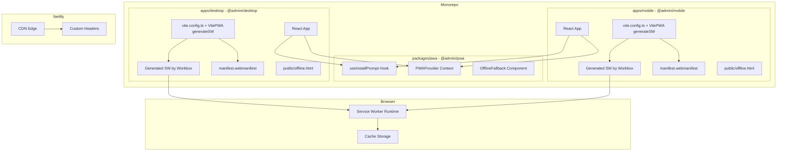
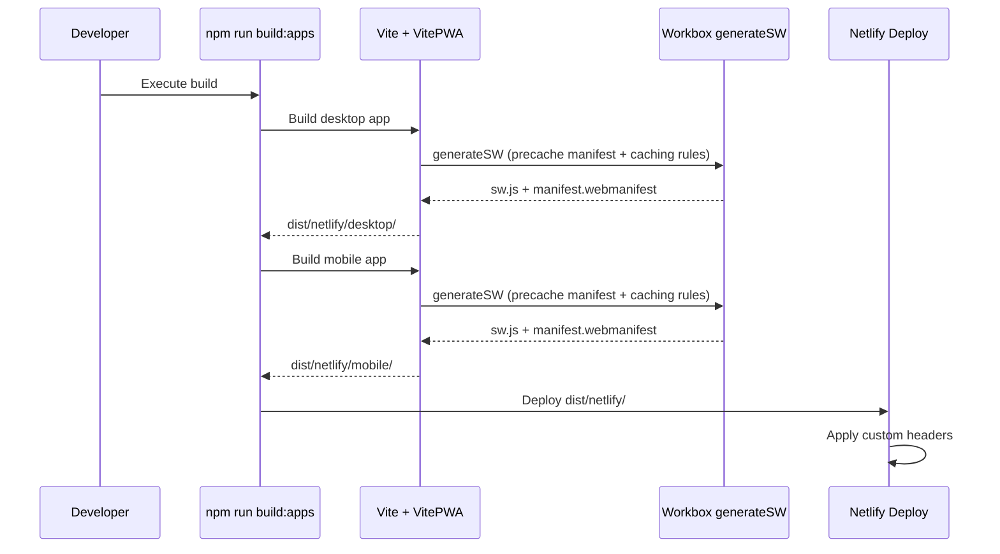

# Design Document: PWA Support (Phase 1 — MVP)

## Overview

This design adds minimal, production-safe Progressive Web App capabilities to both AdminI applications (`@admini/desktop` and `@admini/mobile`). The implementation uses `vite-plugin-pwa` in `generateSW` mode exclusively, adds a UI-only shared package `@admini/pwa`, and produces installable apps with offline fallback support.

**Primary outcomes:**
- Apps install on desktop and mobile browsers
- Static assets are cached via Workbox defaults
- Offline navigation shows a fallback page
- No runtime service worker errors

### Key Design Decisions

1. **`generateSW` only** — Workbox fully owns the service worker. No custom SW source file, no `injectManifest`, no `importScripts`. The generated SW handles all caching and lifecycle automatically.
2. **UI-only shared package** — `@admini/pwa` contains React hooks and components for install prompt and offline detection. It does NOT contain any service worker logic, update orchestration, or backend calls.
3. **Plugin-default update handling** — Uses `registerType: 'prompt'` from vite-plugin-pwa. The plugin exposes an update-available flag; the app shows a reload button. No custom `skipWaiting` messaging.
4. **Static offline fallback** — A plain HTML file (`offline.html`) with a retry button. No React rendering required for the fallback page.
5. **No backend integration** — Push notifications, subscriptions, Edge Functions, and all server contracts are deferred to Phase 2.

### Explicitly Out of Scope (Phase 2)

- Custom service worker code of any kind
- `injectManifest` mode
- Push notifications (frontend or backend)
- Backend Edge Functions or API endpoints
- `postMessage` between app and SW
- SW state machines or lifecycle abstractions
- Property-based testing for SW behavior
- Network simulation tests
- Background sync

## Architecture



### Build Flow



## Components and Interfaces

### `@admini/pwa` Package (UI-Only)

Located at `packages/pwa/`. This package is strictly presentational and browser-state tracking. It does NOT contain service worker logic, update handling logic, caching logic, or any backend calls.

**Package structure:**

```
packages/pwa/
├── src/
│   ├── index.ts              # Public exports
│   ├── hooks/
│   │   └── useInstallPrompt.ts
│   ├── components/
│   │   └── OfflineFallback.tsx
│   ├── context/
│   │   └── PWAProvider.tsx
│   └── types.ts
├── package.json
└── tsconfig.json
```

#### `useInstallPrompt` Hook

```typescript
interface UseInstallPromptReturn {
  /** Whether the app is installable (beforeinstallprompt was captured) */
  isInstallable: boolean;
  /** Whether the app is running in standalone mode */
  isStandalone: boolean;
  /** Trigger the native install prompt */
  promptInstall: () => Promise<'accepted' | 'dismissed'>;
}

function useInstallPrompt(): UseInstallPromptReturn;
```

**Behavior:**
- Listens for the `beforeinstallprompt` event and defers it
- Detects standalone mode via `window.matchMedia('(display-mode: standalone)')`
- Returns `isInstallable: false` when already in standalone mode or after prompt is used
- Cleans up event listeners on unmount

**Does NOT:**
- Manage service worker registration
- Handle SW updates
- Communicate with the service worker

#### `PWAProvider` Context

```typescript
interface PWAContextValue {
  /** Online/offline status */
  isOnline: boolean;
  /** Whether running in standalone mode */
  isStandalone: boolean;
}

function PWAProvider(props: { children: React.ReactNode }): React.ReactElement;
function usePWAContext(): PWAContextValue;
```

**Behavior:**
- Tracks `isOnline` via `navigator.onLine` and `online`/`offline` event listeners
- Detects `isStandalone` via `window.matchMedia('(display-mode: standalone)')`
- Components conditionally render based on connectivity/standalone status

**Does NOT:**
- Manage service worker state
- Track update availability
- Make any API calls

#### `OfflineFallback` Component

```typescript
interface OfflineFallbackProps {
  /** Application name to display */
  appName: string;
}

function OfflineFallback(props: OfflineFallbackProps): React.ReactElement;
```

**Behavior:**
- Renders a minimal offline screen with app branding
- Provides a retry button that calls `window.location.reload()`
- Uses basic ARIA attributes for accessibility

**Does NOT:**
- Listen for network events (that is PWAProvider's job for in-app use)
- Interact with the service worker
- Require React app boot (the actual offline fallback served by Workbox is a static HTML file)

---

### VitePWA Plugin Configuration (LOCKED)

Each app uses this exact configuration with only base-path overrides:

```typescript
// apps/desktop/vite.config.ts
import { VitePWA } from 'vite-plugin-pwa';

VitePWA({
  strategies: 'generateSW',
  registerType: 'prompt',
  workbox: {
    globPatterns: ['**/*.{js,css,html,ico,png,svg,woff2}'],
    navigateFallback: '/desktop/offline.html',
    navigateFallbackDenylist: [/^\/desktop\/api\//]
  },
  manifest: {
    name: 'AdminI Desktop',
    short_name: 'AdminI',
    display: 'standalone',
    start_url: '/desktop/',
    scope: '/desktop/',
    theme_color: '#1a1a2e',
    background_color: '#f7f8fa',
    icons: [
      { src: '/desktop/icons/icon-192x192.png', sizes: '192x192', type: 'image/png', purpose: 'any maskable' },
      { src: '/desktop/icons/icon-512x512.png', sizes: '512x512', type: 'image/png', purpose: 'any maskable' }
    ]
  }
})
```

```typescript
// apps/mobile/vite.config.ts
VitePWA({
  strategies: 'generateSW',
  registerType: 'prompt',
  workbox: {
    globPatterns: ['**/*.{js,css,html,ico,png,svg,woff2}'],
    navigateFallback: '/mobile/offline.html',
    navigateFallbackDenylist: [/^\/mobile\/api\//]
  },
  manifest: {
    name: 'AdminI Mobile',
    short_name: 'AdminI',
    display: 'standalone',
    start_url: '/mobile/',
    scope: '/mobile/',
    theme_color: '#1a1a2e',
    background_color: '#f7f8fa',
    icons: [
      { src: '/mobile/icons/icon-192x192.png', sizes: '192x192', type: 'image/png', purpose: 'any maskable' },
      { src: '/mobile/icons/icon-512x512.png', sizes: '512x512', type: 'image/png', purpose: 'any maskable' }
    ]
  }
})
```

**Nothing else may be added or changed in v1.**

---

### Offline Fallback Pages

Static HTML files placed in each app's `public/` directory:

- `apps/desktop/public/offline.html`
- `apps/mobile/public/offline.html`

**Constraints:**
- Static HTML only — no React, no bundled JS
- Must include a "Retry" button: `<button onclick="window.location.reload()">Retry</button>`
- Basic styling inline
- Accessible (lang attribute, button labeling)

---

### Update Handling

Uses ONLY the built-in `registerType: 'prompt'` behavior from vite-plugin-pwa:

1. Plugin detects new SW version waiting
2. App reads the update-available state from the plugin's virtual module
3. App shows a "Update available — reload" button
4. User clicks → `window.location.reload()`

**No custom logic:**
- No `skipWaiting` messaging
- No `postMessage` to SW
- No update state machines
- No custom orchestration

---

### Netlify Configuration Updates

```toml
# Additions to netlify.toml

[[headers]]
  for = "/desktop/sw.js"
  [headers.values]
    Cache-Control = "no-cache"
    Content-Type = "application/javascript"

[[headers]]
  for = "/mobile/sw.js"
  [headers.values]
    Cache-Control = "no-cache"
    Content-Type = "application/javascript"

[[headers]]
  for = "/desktop/manifest.webmanifest"
  [headers.values]
    Content-Type = "application/manifest+json"

[[headers]]
  for = "/mobile/manifest.webmanifest"
  [headers.values]
    Content-Type = "application/manifest+json"
```

## Data Models

### Manifest Schema (per app)

```typescript
interface WebAppManifest {
  name: string;
  short_name: string;
  start_url: string;
  scope: string;
  display: 'standalone';
  theme_color: string;
  background_color: string;
  icons: Array<{
    src: string;
    sizes: string;
    type: string;
    purpose: string;
  }>;
}
```

### Install Prompt State

```typescript
interface InstallPromptState {
  deferredPrompt: BeforeInstallPromptEvent | null;
  status: 'idle' | 'prompted' | 'accepted' | 'dismissed';
}
```

### PWA Context State

```typescript
interface PWAContextValue {
  isOnline: boolean;
  isStandalone: boolean;
}
```

## Correctness Properties

### Property 1: Install prompt lifecycle integrity

*For any* sequence of `beforeinstallprompt` events and user interactions, the `useInstallPrompt` hook SHALL correctly transition between states: `isInstallable` becomes true only after the event fires, becomes false after the prompt is used or when in standalone mode, and `promptInstall()` resolves with the user's choice.

**Validates: Requirements 4.1, 4.2, 4.3, 4.4**

### Property 2: Offline detection consistency

*For any* sequence of `online`/`offline` events, the `PWAProvider` SHALL reflect the current connectivity state accurately — `isOnline` matches `navigator.onLine` after each event.

**Validates: Requirements 3.5**

### Property 3: External URL detection and routing

*For any* URL string, the link handler SHALL classify it as external (different origin) and open it via `window.open` in a new context, OR classify it as internal (same origin, within app scope) and handle it via client-side routing.

**Validates: Requirements 7.4**

## Error Handling

### Service Worker Registration Failure

- If the generated SW fails to register, the app continues without offline capabilities
- `vite-plugin-pwa` logs the error to console
- No error is thrown to the React tree

### Offline Fallback

- When Workbox's `navigateFallback` triggers, the static `offline.html` is served from precache
- If precache is corrupted, the browser's default offline page appears (unrecoverable edge case)

### Install Prompt Unavailable

- If `beforeinstallprompt` never fires (already installed, unsupported browser, HTTP), `isInstallable` remains false
- No errors, no fallback UI needed — the install button simply does not render

## Testing Strategy

### Required Tests

1. **useInstallPrompt unit test** — Verify event capture, `promptInstall()` trigger, standalone detection, cleanup on unmount
2. **OfflineFallback render test** — Verify component renders with app name, retry button calls `window.location.reload()`
3. **PWAProvider unit test** — Verify `isOnline` tracks `online`/`offline` events, `isStandalone` detects display mode
4. **SW registration smoke test** — Verify build output contains `sw.js` and `manifest.webmanifest` in both dist directories

### Forbidden Tests

- Property-based testing for SW behavior
- SW simulation or lifecycle tests
- Network condition simulation (MSW or otherwise)
- Push notification tests
- API mocking for SW behavior

### Test Libraries

- Vitest + `@testing-library/react`
- Vitest mocks for browser APIs (`matchMedia`, `BeforeInstallPromptEvent`)

## Definition of Done

All must be true:

1. App installs on Chrome desktop
2. App installs on mobile browser (supported browsers)
3. Offline visit shows fallback page
4. Static assets load via cache when online → then work offline
5. No SW runtime errors in console
6. Production build succeeds for both apps
