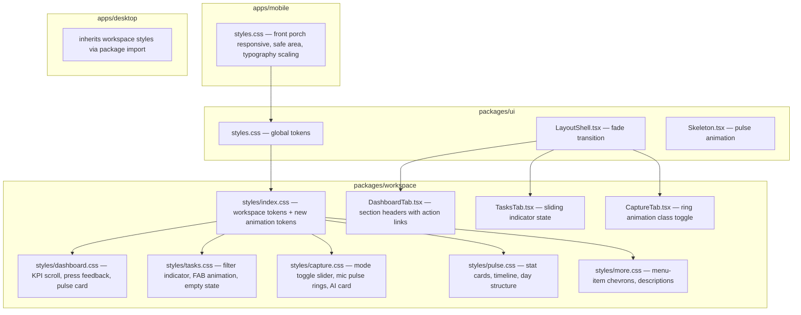

# Design Document: Responsive UI Polish

## Overview

This design addresses two core concerns: making the front porch (auth screens) scale gracefully across all mobile viewport sizes (320px–428px+), and elevating the workspace tabs from functional shells to visually rich, interactive experiences that match the prototype's delight.

The approach is CSS-first: fluid typography via `clamp()`, responsive breakpoints via media queries, and micro-interactions via CSS transitions and keyframe animations. No new dependencies are introduced. Small JS additions are limited to press-feedback event handlers and the filter-pill sliding indicator.

**Key Design Decisions:**

1. **dvh/svh over vh** — Dynamic viewport height avoids the mobile address-bar reflow problem.
2. **clamp() over breakpoint-stepped values** — Provides continuous scaling instead of jarring jumps between sizes.
3. **CSS custom properties for all interactive feedback** — Keeps animation timing and scale values configurable and consistent.
4. **Edge-bleed pattern for KPI scroll** — Negative margins matching parent padding create a full-width scroll track while content maintains padding alignment.
5. **Existing workspace design tokens (`--ws-*`)** — All new styles extend the existing token system rather than introducing parallel values.

## Architecture

The changes span three packages and touch both apps:



**Layers of change:**

| Layer | What changes | Why |
|-------|-------------|-----|
| `packages/ui/src/styles.css` | Add `--transition-press`, animation token for skeleton | Shared interactive feedback timing |
| `packages/ui/src/LayoutShell.tsx` | Add fade-in class on content mount | Requirement 3.3 transition |
| `apps/mobile/src/styles.css` | Front porch responsive rules, safe-area positioning | Requirements 1–2, 6–7 |
| `packages/workspace/src/styles/index.css` | New animation tokens, press-feedback utility class | Foundation for Requirement 8 |
| `packages/workspace/src/styles/*.css` | Per-tab visual enhancements | Requirement 8 sub-criteria |
| `packages/workspace/src/components/*.tsx` | Minor JSX additions (section headers, indicator markup, press handler) | Requirement 8 structure |

## Components and Interfaces

### 1. Front Porch Responsive Layer (`apps/mobile/src/styles.css`)

**New CSS additions** scoped under `.auth-page`:

```css
/* Fluid spacing via clamp + dvh */
.home-panel {
  padding: clamp(48px, 12dvh, 88px) clamp(16px, 5vw, 24px) clamp(40px, 8dvh, 64px);
}

/* Small-height compression */
@media (max-height: 680px) {
  .home-panel { gap: 12px; }
  .logo-name { font-size: clamp(48px, 11.5vw, 84px); }
  .bubble-actions { margin-top: 8px; }
}

/* Safe-area for fixed elements */
.breath-button {
  top: max(18px, env(safe-area-inset-top) + 8px);
  right: max(16px, env(safe-area-inset-right) + 8px);
}

.visual-mode-button {
  bottom: max(22px, env(safe-area-inset-bottom) + 8px);
}
```

**Breakpoint behavior for split-auth:**

| Width | Behavior |
|-------|----------|
| > 820px | Two-column grid (existing) |
| 421–820px | Single-column stacked (auth-story + auth-conversation) |
| ≤ 420px | Hide auth-story entirely, full-width form |

**New media query at ≤ 420px:**

```css
@media (max-width: 420px) {
  .split-auth .auth-story {
    display: none;
  }
  .split-auth {
    grid-template-columns: 1fr;
  }
  .auth-conversation {
    min-height: 100dvh;
    padding: clamp(24px, 6vw, 36px);
  }
}
```

### 2. Workspace Shell Enhancements (`packages/ui/src/LayoutShell.tsx`)

Add a CSS class-based fade-in when content area mounts post-onboarding:

```typescript
// LayoutShell content wrapper gets entered state after initial render
className={`layout-shell__content ${loading ? '' : 'layout-shell__content--entered'}`}
```

```css
.layout-shell__content {
  opacity: 0;
  transform: translateY(4px);
}
.layout-shell__content--entered {
  opacity: 1;
  transform: translateY(0);
  transition: opacity var(--transition-normal), transform var(--transition-normal);
}
```

### 3. DashboardTab Enhancements

**KPI Scroll Strip (edge-bleed pattern):**

```css
.dashboard-tab__kpis {
  display: flex;
  gap: var(--ws-space-md);
  overflow-x: auto;
  scroll-snap-type: x mandatory;
  margin-left: calc(-1 * var(--ws-space-lg));
  margin-right: calc(-1 * var(--ws-space-lg));
  padding: var(--ws-space-sm) var(--ws-space-lg);
  scrollbar-width: none;
}
.dashboard-tab__kpis::-webkit-scrollbar { display: none; }
.dashboard-tab__kpis > * {
  scroll-snap-align: start;
}
```

**Pulse Countdown Card (prototype match):**

New wrapper with icon badge, horizontal flex layout, tinted sage background:

```css
.dashboard-tab__countdown-card {
  display: flex;
  align-items: center;
  gap: var(--ws-space-md);
  background: color-mix(in srgb, var(--ws-color-sage) 8%, var(--ws-color-white));
  border: 1px solid color-mix(in srgb, var(--ws-color-sage) 18%, transparent);
  border-radius: var(--ws-radius-card);
  padding: var(--ws-space-md) var(--ws-space-lg);
  box-shadow: var(--ws-shadow-card);
}
.dashboard-tab__countdown-icon {
  display: flex;
  align-items: center;
  justify-content: center;
  width: 2.5rem;
  height: 2.5rem;
  background: var(--ws-color-sage);
  color: var(--ws-color-white);
  border-radius: var(--ws-radius-md);
  font-size: 1.25rem;
}
.dashboard-tab__countdown-info {
  display: flex;
  flex-direction: column;
  gap: var(--ws-space-xs);
}
.dashboard-tab__countdown-label {
  font-size: var(--ws-font-size-xs);
  color: var(--ws-color-text-muted);
  text-transform: uppercase;
  letter-spacing: 0.06em;
  font-weight: 600;
}
.dashboard-tab__countdown-value {
  font-family: var(--ws-font-display);
  font-size: var(--ws-font-size-xl);
  font-weight: 700;
  color: var(--ws-color-sage-dark);
}
```

**Priority Queue — press feedback + metadata row:**

```css
.dashboard-tab__task-item {
  transition: transform 100ms ease, box-shadow 100ms ease;
}
.dashboard-tab__task-item:active {
  transform: scale(0.99);
  box-shadow: 0 2px 8px rgba(84, 116, 92, 0.04);
}
```

Task items gain a metadata row with due date and source icon:

```tsx
<div className="dashboard-tab__task-meta">
  <span className="dashboard-tab__task-due">Due {date}</span>
  <span className="dashboard-tab__task-source" aria-label="source">📋</span>
</div>
```

**Section headers with trailing action link:**

```tsx
<header className="dashboard-tab__section-header">
  <h2>Priority Queue</h2>
  <button type="button" className="dashboard-tab__section-link">View all</button>
</header>
```

```css
.dashboard-tab__section-header {
  display: flex;
  align-items: baseline;
  justify-content: space-between;
  margin-bottom: var(--ws-space-md);
}
.dashboard-tab__section-link {
  background: none;
  border: none;
  color: var(--ws-color-sage);
  font-size: var(--ws-font-size-sm);
  font-weight: 600;
  cursor: pointer;
  padding: 0;
  transition: color var(--ws-transition-fast);
}
.dashboard-tab__section-link:hover {
  color: var(--ws-color-sage-dark);
}
```

### 4. TasksTab Enhancements

**Sliding filter indicator:**

A `<span className="tasks-tab__filter-indicator">` positioned absolutely within the filter container, with `transform: translateX()` driven by the active filter index via inline style.

```css
.tasks-tab__filters {
  position: relative;
}
.tasks-tab__filter-indicator {
  position: absolute;
  bottom: 0;
  left: 0;
  height: 3px;
  background: var(--ws-color-sage);
  border-radius: var(--ws-radius-pill);
  transition: transform var(--ws-transition-normal), width var(--ws-transition-normal);
  pointer-events: none;
}
```

Component state addition:

```typescript
// Track indicator position via refs on each pill
const filterRefs = useRef<Record<TaskFilter, HTMLButtonElement | null>>({});
const [indicatorStyle, setIndicatorStyle] = useState({ left: 0, width: 0 });

useEffect(() => {
  const el = filterRefs.current[filter];
  if (el) {
    setIndicatorStyle({ left: el.offsetLeft, width: el.offsetWidth });
  }
}, [filter]);
```

**FAB enhancement (sage-deep, elevation, scale animation):**

```css
.tasks-tab__fab {
  background: var(--ws-color-sage-dark);
  box-shadow: var(--ws-shadow-elevated);
  transition: transform var(--ws-transition-fast), box-shadow var(--ws-transition-fast);
}
.tasks-tab__fab:hover,
.tasks-tab__fab:active {
  transform: scale(1.08);
  box-shadow: 0 6px 20px rgba(74, 107, 74, 0.25);
}
```

**Empty state (prototype capture-empty pattern):**

```css
.tasks-tab__empty-state {
  text-align: center;
  padding: var(--ws-space-2xl) var(--ws-space-lg);
}
.tasks-tab__empty-title {
  font-size: var(--ws-font-size-lg);
  font-weight: 600;
  color: var(--ws-color-text);
  margin: 0 0 var(--ws-space-sm);
}
.tasks-tab__empty-desc {
  font-size: var(--ws-font-size-sm);
  color: var(--ws-color-text-muted);
  margin: 0;
  max-width: 24ch;
  margin-inline: auto;
}
```

### 5. CaptureTab Enhancements

**Mode toggle sliding indicator:**

Similar to the filter indicator — a background pill that slides between Voice/Tap using CSS `translateX`:

```css
.capture-tab__mode-toggle {
  position: relative;
}
.capture-tab__mode-indicator {
  position: absolute;
  top: var(--ws-space-xs);
  bottom: var(--ws-space-xs);
  left: var(--ws-space-xs);
  width: calc(50% - var(--ws-space-xs));
  background: var(--ws-color-white);
  border-radius: var(--ws-radius-pill);
  box-shadow: var(--ws-shadow-card);
  transition: transform var(--ws-transition-normal);
  pointer-events: none;
}
.capture-tab__mode-indicator--tap {
  transform: translateX(100%);
}
```

**Mic button animated ring pulses:**

```css
@keyframes mic-pulse {
  0% { transform: scale(1); opacity: 0.6; }
  100% { transform: scale(1.8); opacity: 0; }
}

.capture-tab__mic-btn {
  position: relative;
}

.capture-tab__mic-btn--recording::before,
.capture-tab__mic-btn--recording::after {
  content: '';
  position: absolute;
  inset: 0;
  border-radius: 50%;
  border: 2px solid var(--ws-color-sage);
  animation: mic-pulse 2s ease-out infinite;
  pointer-events: none;
}
.capture-tab__mic-btn--recording::after {
  animation-delay: 1s;
}
```

**AI suggestion card with sparkle icon header:**

```tsx
<div className="capture-tab__ai-suggestion-header">
  <svg className="capture-tab__ai-sparkle" viewBox="0 0 16 16" width="16" height="16" aria-hidden="true">
    <path d="M8 0l1.5 5.5L16 8l-6.5 2.5L8 16l-1.5-5.5L0 8l6.5-2.5z" fill="currentColor"/>
  </svg>
  <span className="capture-tab__ai-badge">AI</span>
  <span className="capture-tab__ai-label">Suggestion</span>
</div>
```

```css
.capture-tab__ai-sparkle {
  color: var(--ws-color-sage);
}
```

### 6. PulseTab Enhancements

**Stat cards row (value + label):**

Already structured correctly. Enhanced styling:

```css
.pulse-tab__stat-card {
  background: var(--ws-color-white);
  border-radius: var(--ws-radius-card);
  padding: var(--ws-space-md);
  box-shadow: var(--ws-shadow-card);
  text-align: center;
}
.pulse-tab__stat-value {
  font-family: var(--ws-font-display);
  font-size: var(--ws-font-size-xl);
  font-weight: 700;
  color: var(--ws-color-sage);
}
```

**Day structure visualization with gradient time blocks:**

```css
.pulse-tab__day-row {
  position: relative;
  padding-left: var(--ws-space-lg);
}
.pulse-tab__day-row::before {
  content: '';
  position: absolute;
  left: 0;
  top: 50%;
  transform: translateY(-50%);
  width: 4px;
  height: 70%;
  border-radius: var(--ws-radius-pill);
  background: linear-gradient(180deg, var(--ws-color-sage-light), var(--ws-color-sage-dark));
}
```

### 7. MoreTab Enhancements

**Menu items with trailing chevron and optional description:**

```tsx
<button className="more-tab__link-btn">
  <span className="more-tab__link-icon" aria-hidden="true">👤</span>
  <div className="more-tab__link-content">
    <span className="more-tab__link-label">Profile</span>
    <span className="more-tab__link-desc">Manage your account</span>
  </div>
  <span className="more-tab__link-chevron" aria-hidden="true">›</span>
</button>
```

```css
.more-tab__link-content {
  display: flex;
  flex-direction: column;
  flex: 1;
  gap: 2px;
}
.more-tab__link-desc {
  font-size: var(--ws-font-size-xs);
  color: var(--ws-color-text-muted);
  font-weight: 400;
}
.more-tab__link-chevron {
  margin-left: auto;
  color: var(--ws-color-text-muted);
  font-size: 1.5rem;
  line-height: 1;
  transition: transform var(--ws-transition-fast);
}
.more-tab__link-btn:hover .more-tab__link-chevron {
  transform: translateX(2px);
}
```

### 8. Global Press Feedback Utility

A shared utility class for any workspace card/list-item:

```css
/* packages/workspace/src/styles/index.css */
.ws-press-feedback {
  transition: transform 100ms ease, box-shadow 100ms ease;
  -webkit-tap-highlight-color: transparent;
}
.ws-press-feedback:active {
  transform: scale(0.99);
  box-shadow: 0 1px 4px rgba(0, 0, 0, 0.04);
}
```

### 9. Skeleton Loading Enhancement

Replace all plain-text loading indicators (`<p>Loading...</p>`) in tab components with `<SkeletonCard>` components from `@admini/ui`:

```tsx
// Before
if (loading) return <div className="dashboard-tab--loading"><p>Loading dashboard...</p></div>;

// After
if (loading) return (
  <div className="dashboard-tab--loading" aria-busy="true">
    <SkeletonCard height={80} />
    <SkeletonCard height={160} />
    <SkeletonCard height={120} />
  </div>
);
```

### 10. Workspace Background Gradient

Apply a subtle gradient background to the workspace content area matching the prototype richness:

```css
.layout-shell__content {
  background: linear-gradient(
    180deg,
    var(--color-limestone-light) 0%,
    var(--color-bg) 40%,
    var(--color-bg) 100%
  );
}
```

## Data Models

This feature introduces no new data models or API changes. All changes are presentational (CSS + minor JSX structure). The existing data flows remain unchanged:

- `DashboardTab` fetches from `dashboardService` → renders KPIs, tasks, events
- `TasksTab` fetches from `dashboardService.getTasks()` → filters in-memory
- `CaptureTab` manages local state only
- `PulseTab` uses placeholder data (future service integration)
- `MoreTab` is static navigation

**New component state (minimal JS):**

| Component | State Addition | Purpose |
|-----------|---------------|---------|
| `TasksTab` | `indicatorStyle: { left, width }` | Position the sliding filter indicator |
| `CaptureTab` | (existing `mode` state) | Mode toggle indicator derived from `mode` |
| `LayoutShell` | (existing `loading` prop) | Controls `--entered` class |

## Error Handling

This feature does not introduce new error-prone logic. Existing error handling remains intact.

**Defensive measures for the responsive/visual changes:**

1. **Layout overflow prevention** — `clamp()`, `dvh`, and `overflow-x: auto` prevent content from clipping or causing horizontal scroll on the page body.
2. **Safe-area fallback** — `env(safe-area-inset-*)` gracefully falls back to `0px` on devices without notches. The `max()` function ensures minimum spacing regardless.
3. **Reduced motion** — A `prefers-reduced-motion` media query disables transitions and keyframe animations:

```css
@media (prefers-reduced-motion: reduce) {
  .ws-press-feedback,
  .capture-tab__mic-btn--recording::before,
  .capture-tab__mic-btn--recording::after,
  .tasks-tab__filter-indicator,
  .capture-tab__mode-indicator,
  .layout-shell__content--entered {
    animation: none !important;
    transition-duration: 0ms !important;
  }
}
```

4. **Keyboard visibility (Req 2.3)** — Relies on native browser scroll-into-view behavior when inputs are focused with the on-screen keyboard active. No custom JS handling needed — the `dvh` unit and flexible layout ensure the form remains within the reduced viewport.
5. **Graceful degradation** — All new CSS uses well-supported features (clamp, env(), dvh have 95%+ browser support). Older browsers that don't support `dvh` fall back to the existing `min-height: 100%` rule.

## Testing Strategy

### Why Property-Based Testing Does Not Apply

This feature is entirely about **UI rendering, CSS layout, and visual micro-interactions**. There are no pure functions with varied inputs, no data transformations, no parsers or serializers, and no algorithmic business logic. The acceptance criteria describe visual states at specific breakpoints and animation behaviors — these cannot be meaningfully expressed as universal quantification properties.

### Testing Approaches

**1. Visual Regression Tests (Primary validation method)**

Screenshot comparison at key breakpoints:

| Breakpoint | Device Model | Key Assertions |
|------------|-------------|----------------|
| 320 × 568 | iPhone SE | Front porch fits, no overflow, buttons visible |
| 375 × 667 | iPhone 8 | Baseline mobile, all content visible |
| 390 × 844 | iPhone 14 | Standard layout, KPI scroll works |
| 428 × 926 | iPhone 14 Pro Max | Large phone, proportionate spacing |
| 820 × 1180 | iPad | Split-auth two-column renders |

Tool: Playwright with `page.screenshot()` comparisons.

**2. Component Unit Tests (Structure verification)**

Verify component JSX renders expected elements and classes:

- `DashboardTab` renders `.dashboard-tab__section-header` with action link
- `DashboardTab` renders `.dashboard-tab__countdown-card` with icon badge
- `TasksTab` renders `.tasks-tab__filter-indicator` element
- `TasksTab` indicator position updates when filter state changes
- `CaptureTab` mic button gains `--recording` class when `isRecording` is true
- `CaptureTab` renders `.capture-tab__mode-indicator` element
- `MoreTab` menu items include `.more-tab__link-chevron` and `.more-tab__link-desc`
- `LayoutShell` content area gains `--entered` class when `loading` is false
- All tab loading states render `<SkeletonCard>` instead of text

Tool: Vitest + React Testing Library (already configured in `packages/workspace`).

**3. Interaction Tests (Behavior verification)**

- Press feedback: simulate `pointerdown` on task card, assert active class applied
- Filter pill click: assert indicator style `left` changes to match new pill position
- Mode toggle: assert indicator gains `--tap` class when Tap mode selected
- FAB hover: verify scale transform class/style applied

Tool: Playwright component tests or React Testing Library with `fireEvent`.

**4. Accessibility Compliance**

- All interactive elements maintain 44×44px minimum touch targets on viewports < 360px
- `prefers-reduced-motion: reduce` disables all animations
- Focus indicators remain visible on all buttons and links
- ARIA labels present on icon-only buttons (FAB, mic, mode toggle)
- Color contrast ratios maintained with sage/limestone palette

Tool: axe-core via Playwright or jest-axe in component tests.

**5. CSS Smoke Tests (Breakpoint verification)**

Small Playwright scripts that:
- Load auth page at 320px width → assert no horizontal scrollbar
- Load auth page at 420px width → assert `.auth-story` is hidden
- Load dashboard at 428px width → assert KPI section scrolls horizontally
- Load workspace → assert no element exceeds viewport width

### Test File Organization

| Location | Focus |
|----------|-------|
| `packages/workspace/__tests__/` | Component structure, state, interaction |
| `packages/ui/__tests__/` | LayoutShell transition, Skeleton rendering |
| `apps/mobile/e2e/` | Visual regression, responsive breakpoints |
