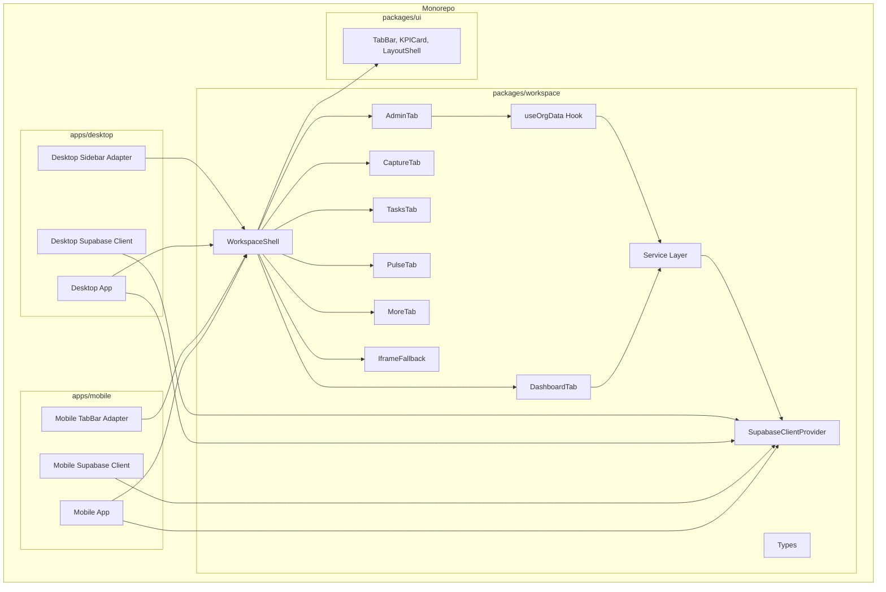
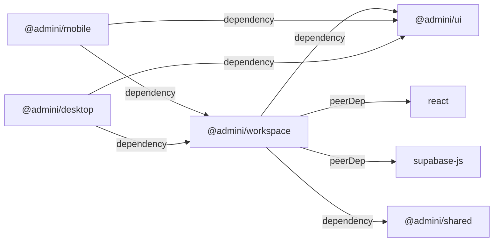

# Design Document: Shared Workspace Package

## Overview

This design defines the architecture for extracting workspace components, services, and hooks from `apps/mobile/src/workspace/` into a shared monorepo package (`packages/workspace`). The package uses dependency injection (React Context for the Supabase client, render props for navigation) to remain platform-agnostic. Both the mobile and desktop apps consume the same package, with platform-specific adapters handling navigation chrome and client initialization.

**Key design decisions:**
- **No build step** — follows the existing monorepo pattern where consumers handle TypeScript via the `exports` field pointing to source `.ts` files.
- **React Context for Supabase client** — avoids singleton coupling; each app provides its own configured client instance at the top of the tree.
- **Render prop for navigation** — WorkspaceShell accepts a `renderNavigation` function so mobile can pass a bottom TabBar and desktop can pass a sidebar without forking shell logic.
- **Gradual migration** — IframeFallback remains available for any tabs not yet converted, ensuring zero regressions during rollout.

## Architecture

### High-Level System Diagram



### Package Dependency Graph



## Components and Interfaces

### 1. Package Entry Point (`packages/workspace/src/index.ts`)

The barrel file re-exports all public API surface:

```typescript
// Components
export { WorkspaceShell } from './components/WorkspaceShell';
export { DashboardTab } from './components/DashboardTab';
export { AdminTab } from './components/AdminTab';
export { CaptureTab } from './components/CaptureTab';
export { TasksTab } from './components/TasksTab';
export { PulseTab } from './components/PulseTab';
export { MoreTab } from './components/MoreTab';
export { IframeFallback } from './components/IframeFallback';

// Hooks
export { useOrgData } from './hooks/useOrgData';

// Services
export * as dashboardService from './services/dashboardService';
export * as organizationService from './services/organizationService';
export * as invitationService from './services/invitationService';

// Provider
export { SupabaseClientProvider, useSupabaseClient } from './providers/SupabaseClientProvider';

// Types
export type {
  WorkspaceTab,
  AdminiRole,
  OrgDetails,
  OrgDetailsForm,
  OrgMember,
  OrgInvitation,
  OrgFeatureFlag,
  ActivityEvent,
  DashboardTask,
  DashboardKPIs,
  NavigationAdapterProps,
  WorkspaceShellProps,
} from './types';
```

### 2. SupabaseClientProvider (React Context)

```typescript
// packages/workspace/src/providers/SupabaseClientProvider.tsx
import { createContext, useContext, useEffect, useRef, type ReactNode } from 'react';
import type { SupabaseClient } from '@supabase/supabase-js';
import { configureClient, resetClient } from '../services/getClient';

const SupabaseClientContext = createContext<SupabaseClient | null>(null);

export interface SupabaseClientProviderProps {
  client: SupabaseClient;
  children: ReactNode;
}

export function SupabaseClientProvider({ client, children }: SupabaseClientProviderProps) {
  // Synchronously configure so services work during first render cycle
  const configured = useRef(false);
  if (!configured.current) {
    configureClient(client);
    configured.current = true;
  }

  // Re-configure if client changes; clean up on unmount
  useEffect(() => {
    configureClient(client);
    return () => resetClient();
  }, [client]);

  return (
    <SupabaseClientContext.Provider value={client}>
      {children}
    </SupabaseClientContext.Provider>
  );
}

export function useSupabaseClient(): SupabaseClient {
  const client = useContext(SupabaseClientContext);
  if (!client) {
    throw new Error(
      '@admini/workspace: Supabase client is not configured. ' +
      'Wrap your app in <SupabaseClientProvider client={...}>.'
    );
  }
  return client;
}
```

**Design rationale:** React Context is the standard pattern for dependency injection in React trees. Unlike a module-level singleton, this allows multiple test renders with different mock clients and avoids import-time coupling to environment variables. The module-level `configureClient` bridge allows service functions (which are plain async functions, not hooks) to access the client without threading it through every call.

### 3. Service Layer with Dependency Injection

Services transition from importing a module-level client to receiving one via a `getClient` function backed by the provider.

```typescript
// packages/workspace/src/services/getClient.ts
import type { SupabaseClient } from '@supabase/supabase-js';

let _client: SupabaseClient | null = null;

/**
 * Configure the service-layer Supabase client.
 * Called by SupabaseClientProvider on mount.
 */
export function configureClient(client: SupabaseClient): void {
  _client = client;
}

/**
 * Retrieve the configured client, or throw if missing.
 */
export function getClient(): SupabaseClient {
  if (!_client) {
    throw new Error(
      '@admini/workspace: Supabase client is not configured. ' +
      'Wrap your app in <SupabaseClientProvider client={...}>.'
    );
  }
  return _client;
}

/**
 * Reset client reference (for testing teardown).
 */
export function resetClient(): void {
  _client = null;
}
```

**Service function signature (unchanged externally):**

```typescript
// packages/workspace/src/services/dashboardService.ts
import { getClient } from './getClient';
import type { DashboardTask, ActivityEvent, DashboardKPIs } from '../types';

export async function getTasks(): Promise<DashboardTask[]> {
  const client = getClient(); // throws if not configured
  const { data, error } = await client
    .from('tasks')
    .select('id, organization_id, created_by, title, description, priority, status, due_at, created_at, updated_at')
    .neq('status', 'archived')
    .order('created_at', { ascending: false });
  if (error) throw new DashboardServiceError(error.message, error.code);
  return (data ?? []).map(mapTask);
}
```

### 4. WorkspaceShell with Navigation Adapter

```typescript
// packages/workspace/src/components/WorkspaceShell.tsx
import { useState, useMemo, useEffect, type ReactNode } from 'react';
import type { WorkspaceTab, TabItem, NavigationAdapterProps, WorkspaceShellProps } from '../types';
import { DashboardTab } from './DashboardTab';
import { AdminTab } from './AdminTab';
import { CaptureTab } from './CaptureTab';
import { TasksTab } from './TasksTab';
import { PulseTab } from './PulseTab';
import { MoreTab } from './MoreTab';
import { IframeFallback } from './IframeFallback';

/** Set of tabs with native React implementations. */
const NATIVE_TABS: ReadonlySet<WorkspaceTab> = new Set([
  'dashboard', 'admin', 'capture', 'tasks', 'pulse', 'more',
]);

export function WorkspaceShell({
  user,
  userRole,
  userName,
  schoolName,
  prototypePath,
  onSignOut,
  onResetUserData,
  renderNavigation,
}: WorkspaceShellProps) {
  const [activeTab, setActiveTab] = useState<WorkspaceTab>('dashboard');

  // Role guard: redirect non-admin users away from the admin tab
  useEffect(() => {
    if (activeTab === 'admin' && userRole !== 'admin') {
      setActiveTab('dashboard');
    }
  }, [activeTab, userRole]);

  // Build tab list, conditionally including Admin for admin role
  const visibleTabs: TabItem[] = useMemo(() => {
    const base: TabItem[] = [
      { id: 'capture', label: 'Capture' },
      { id: 'dashboard', label: 'Dashboard' },
      { id: 'tasks', label: 'Tasks' },
      { id: 'pulse', label: 'Pulse' },
      { id: 'more', label: 'More' },
    ];
    if (userRole === 'admin') {
      base.push({ id: 'admin', label: 'Admin' });
    }
    return base;
  }, [userRole]);

  // IframeFallback visibility
  const iframeVisible = !NATIVE_TABS.has(activeTab);

  // User payload for iframe bridge
  const userPayload = useMemo(() => ({
    type: 'user-data',
    user: { id: user.id, email: user.email, displayName: userName, schoolName },
    role: userRole,
  }), [user.id, user.email, userName, schoolName, userRole]);

  function handleTabChange(tabId: string) {
    setActiveTab(tabId as WorkspaceTab);
  }

  function renderTabContent(): ReactNode {
    switch (activeTab) {
      case 'dashboard': return <DashboardTab userName={userName} />;
      case 'admin': return userRole === 'admin' ? <AdminTab organizationId={user.id} /> : null;
      case 'capture': return <CaptureTab />;
      case 'tasks': return <TasksTab />;
      case 'pulse': return <PulseTab />;
      case 'more': return <MoreTab onSignOut={onSignOut} />;
      default: return null;
    }
  }

  return (
    <>
      {renderNavigation({ activeTab, tabs: visibleTabs, onTabChange: handleTabChange })}
      {NATIVE_TABS.has(activeTab) && renderTabContent()}
      <IframeFallback
        src={prototypePath}
        visible={iframeVisible}
        userPayload={userPayload}
        onSignOut={onSignOut}
        onResetUserData={onResetUserData}
      />
    </>
  );
}
```

### 5. Mobile App Integration (Consumer)

```typescript
// apps/mobile/src/App.tsx (after migration)
import {
  SupabaseClientProvider,
  WorkspaceShell,
} from '@admini/workspace';
import { TabBar } from '@admini/ui';
import { supabase } from './supabaseClient';

function MobileWorkspace({ user, userRole, userName, schoolName, prototypePath, onSignOut, onResetUserData }: Props) {
  return (
    <SupabaseClientProvider client={supabase}>
      <WorkspaceShell
        user={user}
        userRole={userRole}
        userName={userName}
        schoolName={schoolName}
        prototypePath={prototypePath}
        onSignOut={onSignOut}
        onResetUserData={onResetUserData}
        renderNavigation={({ activeTab, tabs, onTabChange }) => (
          <TabBar tabs={tabs} activeTab={activeTab} onTabChange={onTabChange} />
        )}
      />
    </SupabaseClientProvider>
  );
}
```

### 6. Desktop App Integration (Consumer)

```typescript
// apps/desktop/src/Workspace.tsx (replaces ProtectedWorkspace iframe)
import {
  SupabaseClientProvider,
  WorkspaceShell,
} from '@admini/workspace';
import { supabase } from './supabase';
import { DesktopSidebar } from './components/DesktopSidebar';

function DesktopWorkspace({ user, userRole, userName, schoolName, prototypePath, onSignOut, onResetUserData }: Props) {
  return (
    <SupabaseClientProvider client={supabase!}>
      <WorkspaceShell
        user={user}
        userRole={userRole}
        userName={userName}
        schoolName={schoolName}
        prototypePath={prototypePath}
        onSignOut={onSignOut}
        onResetUserData={onResetUserData}
        renderNavigation={({ activeTab, tabs, onTabChange }) => (
          <DesktopSidebar tabs={tabs} activeTab={activeTab} onTabChange={onTabChange} />
        )}
      />
    </SupabaseClientProvider>
  );
}
```

### 7. Desktop Sidebar Navigation Adapter

```typescript
// apps/desktop/src/components/DesktopSidebar.tsx
import type { NavigationAdapterProps } from '@admini/workspace';

const TAB_ICONS: Record<string, string> = {
  capture: '📝',
  dashboard: '📊',
  tasks: '✅',
  pulse: '💓',
  more: '⚙️',
  admin: '🔧',
};

export function DesktopSidebar({ activeTab, tabs, onTabChange }: NavigationAdapterProps) {
  return (
    <nav className="desktop-sidebar" aria-label="Workspace navigation">
      <div className="desktop-sidebar__brand">AdminI.</div>
      <ul className="desktop-sidebar__tabs" role="tablist">
        {tabs.map((tab) => (
          <li key={tab.id} role="presentation">
            <button
              type="button"
              role="tab"
              className={`desktop-sidebar__tab${activeTab === tab.id ? ' desktop-sidebar__tab--active' : ''}`}
              onClick={() => onTabChange(tab.id)}
              aria-selected={activeTab === tab.id}
              aria-controls={`panel-${tab.id}`}
            >
              <span className="desktop-sidebar__icon" aria-hidden="true">
                {TAB_ICONS[tab.id] ?? '📄'}
              </span>
              <span className="desktop-sidebar__label">{tab.label}</span>
            </button>
          </li>
        ))}
      </ul>
    </nav>
  );
}
```

### 8. File Structure

```
packages/workspace/
├── package.json
├── tsconfig.json
├── src/
│   ├── index.ts
│   ├── types.ts
│   ├── providers/
│   │   └── SupabaseClientProvider.tsx
│   ├── services/
│   │   ├── getClient.ts
│   │   ├── dashboardService.ts
│   │   ├── organizationService.ts
│   │   └── invitationService.ts
│   ├── hooks/
│   │   └── useOrgData.ts
│   ├── components/
│   │   ├── WorkspaceShell.tsx
│   │   ├── DashboardTab.tsx
│   │   ├── AdminTab.tsx
│   │   ├── CaptureTab.tsx
│   │   ├── TasksTab.tsx
│   │   ├── PulseTab.tsx
│   │   ├── MoreTab.tsx
│   │   └── IframeFallback.tsx
│   └── styles/
│       ├── index.css
│       ├── dashboard.css
│       ├── admin.css
│       ├── capture.css
│       ├── tasks.css
│       ├── pulse.css
│       ├── more.css
│       └── iframe-fallback.css
└── __tests__/
    ├── services/
    │   ├── dashboardService.test.ts
    │   ├── organizationService.test.ts
    │   └── invitationService.test.ts
    ├── components/
    │   └── WorkspaceShell.test.tsx
    └── properties/
        └── workspace.property.test.ts
```

## Data Models

### Core Types (extracted to `packages/workspace/src/types.ts`)

```typescript
import type { ReactNode } from 'react';

// Tab identification
export type WorkspaceTab = 'capture' | 'dashboard' | 'tasks' | 'pulse' | 'more' | 'admin';

// Roles
export type AdminiRole = 'admin' | 'principal' | 'teacher' | 'staff';

// Organization
export interface OrgDetails {
  id: string;
  name: string;
  slug: string | null;
  address: string | null;
  contactEmail: string | null;
  contactPhone: string | null;
}

export interface OrgDetailsForm {
  name?: string;
  address?: string;
  contactEmail?: string;
  contactPhone?: string;
}

export interface OrgMember {
  profileId: string;
  email: string;
  displayName: string;
  role: AdminiRole;
  joinedAt: string;
}

export interface OrgInvitation {
  id: string;
  email: string;
  role: AdminiRole;
  status: 'pending' | 'accepted' | 'revoked' | 'expired';
  createdAt: string;
  expiresAt: string;
}

export interface OrgFeatureFlag {
  id: string;
  flagKey: string;
  enabled: boolean;
}

// Dashboard
export interface DashboardTask {
  id: string;
  organizationId: string;
  createdBy: string;
  title: string;
  description?: string;
  priority: 'low' | 'normal' | 'high' | 'urgent';
  status: 'open' | 'in_progress' | 'completed' | 'archived';
  dueAt?: string;
  createdAt: string;
  updatedAt: string;
}

export interface DashboardKPIs {
  openTasks: number;
  completedThisWeek: number;
  overdueTasks: number;
  nextPulseAt: string | null;
}

export interface ActivityEvent {
  id: string;
  organizationId: string;
  actorId: string;
  entityType: string;
  entityId: string;
  action: string;
  createdAt: string;
}

// Navigation adapter contract
export interface TabItem {
  id: string;
  label: string;
}

export interface NavigationAdapterProps {
  activeTab: WorkspaceTab;
  tabs: TabItem[];
  onTabChange: (tabId: WorkspaceTab) => void;
}

// Auth user (minimal shape expected by workspace)
export interface AuthUser {
  id: string;
  email?: string | null;
  displayName?: string | null;
  schoolName?: string | null;
}

// WorkspaceShell props
export interface WorkspaceShellProps {
  user: AuthUser;
  userRole: string;
  userName: string;
  schoolName: string;
  prototypePath: string;
  onSignOut: () => void;
  onResetUserData: () => void;
  renderNavigation: (props: NavigationAdapterProps) => ReactNode;
}
```

### Package Configuration (`packages/workspace/package.json`)

```json
{
  "name": "@admini/workspace",
  "version": "0.1.0",
  "private": true,
  "type": "module",
  "exports": {
    ".": "./src/index.ts",
    "./styles.css": "./src/styles/index.css"
  },
  "scripts": {
    "typecheck": "tsc -p tsconfig.json",
    "test": "vitest --run",
    "test:watch": "vitest"
  },
  "dependencies": {
    "@admini/ui": "0.1.0",
    "@admini/shared": "0.1.0"
  },
  "peerDependencies": {
    "react": "^18.3.1",
    "@supabase/supabase-js": "^2.45.0"
  },
  "devDependencies": {
    "@testing-library/react": "^14.0.0",
    "@types/react": "^18.3.3",
    "fast-check": "^3.15.0",
    "typescript": "^5.5.4",
    "vitest": "^1.6.0"
  }
}
```

### TypeScript Configuration (`packages/workspace/tsconfig.json`)

```json
{
  "extends": "../../tsconfig.base.json",
  "include": ["src"]
}
```

## Correctness Properties

*A property is a characteristic or behavior that should hold true across all valid executions of a system — essentially, a formal statement about what the system should do. Properties serve as the bridge between human-readable specifications and machine-verifiable correctness guarantees.*

### Property 1: Supabase client injection propagates to services

*For any* valid SupabaseClient instance provided to `configureClient()`, all subsequent calls to `getClient()` SHALL return that exact instance (reference equality).

**Validates: Requirements 3.2, 3.3**

### Property 2: Missing client produces descriptive error

*For any* service function in the service layer (getTasks, getActivityEvents, getDashboardKPIs, getOrgDetails, listOrgMembers, listInvitations, createInvitation, revokeInvitation, updateOrgDetails, updateMemberRole, listFeatureFlags, toggleFeatureFlag), calling it before a Supabase client has been configured SHALL throw an error whose message contains "not configured".

**Validates: Requirements 3.4, 10.4**

### Property 3: Native tabs route to native components

*For any* tab in the NATIVE_TABS set and any valid WorkspaceShell props, activating that tab SHALL cause the corresponding native Tab_Content_Component to render (not IframeFallback).

**Validates: Requirements 5.3, 7.2**

### Property 4: Non-native tabs route to IframeFallback

*For any* tab NOT in the NATIVE_TABS set, activating that tab SHALL cause WorkspaceShell to render IframeFallback with `visible=true`.

**Validates: Requirements 6.2**

### Property 5: Role-gated tab filtering

*For any* user role that is not `'admin'`, the `tabs` array passed to the `renderNavigation` adapter SHALL NOT contain a tab with id `'admin'`. Conversely, for role `'admin'`, the tabs array SHALL contain the admin tab.

**Validates: Requirements 4.4, 4.5**

### Property 6: IframeFallback remains mounted when hidden

*For any* sequence of tab activations, the IframeFallback component SHALL always remain in the DOM. When the active tab is a native tab, IframeFallback SHALL have `visible=false` (rendered with display:none style).

**Validates: Requirements 6.4**

### Property 7: Service output shape conformance

*For any* valid Supabase response row matching the DB column schema, the service mapping functions (mapTask, mapSyncEvent, mapInvitation, mapOrgDetails, mapMember, mapFlag) SHALL produce an output object where all required fields defined in the corresponding exported TypeScript interface are present and non-undefined.

**Validates: Requirements 10.3**

### Property 8: Sort-by-urgency idempotence

*For any* array of DashboardTask objects, applying `sortByUrgency` to the array and then applying `sortByUrgency` again to the result SHALL produce the same ordering as the first sort (idempotence / stability).

**Validates: Requirements 10.5**

## Error Handling

### Service Layer Errors

| Scenario | Behavior |
|----------|----------|
| No Supabase client configured | Throw `Error` with message containing "not configured" |
| Supabase query returns an error | Throw typed `ServiceError` / `DashboardServiceError` wrapping the Supabase error message and code |
| Network failure during query | Error propagates as standard `Error`; consuming component shows retry UI |
| Invalid org ID / resource not found | Supabase error wrapped and re-thrown with descriptive message |
| 403 authorization error | Service re-throws; AdminTab UI detects via `is403Error()` and shows "Insufficient permissions" |

### Component Error States

- Each tab component manages its own loading/error states internally (loading spinners, error banners with retry buttons).
- WorkspaceShell does NOT wrap tabs in a shared error boundary — tabs fail independently to prevent one broken tab from taking down the workspace.
- IframeFallback degrades gracefully if the iframe `src` fails to load (rendered but shows browser default error page within the frame).

### Provider Configuration Errors

- `useSupabaseClient()` throws synchronously if called outside a `<SupabaseClientProvider>` — this is a developer error caught during development.
- `getClient()` throws with a message containing "not configured" if called before the provider has been mounted — this surfaces immediately during app startup if wiring is incorrect.

## Testing Strategy

### Unit Tests (Example-Based)

- **Component rendering**: Verify each tab renders expected elements with mock data (React Testing Library).
- **Export verification**: Confirm all named exports from `@admini/workspace` are defined.
- **IframeFallback postMessage bridge**: Send mock messages via `window.dispatchEvent`, verify handler calls correct service functions.
- **Navigation adapter integration**: Render WorkspaceShell with a spy `renderNavigation`, verify correct `tabs`/`activeTab`/`onTabChange` args.
- **Error states**: Verify error banners and retry buttons render when services throw.

### Property-Based Tests (via fast-check)

The package uses [fast-check](https://github.com/dubzzz/fast-check) for property-based testing with Vitest.

**Configuration:**
- Minimum 100 iterations per property test
- Each test tagged with property reference comment

**Properties to implement:**

1. **Client injection** — Feature: shared-workspace-package, Property 1: Supabase client injection propagates to services
2. **Missing client error** — Feature: shared-workspace-package, Property 2: Missing client produces descriptive error
3. **Native tab routing** — Feature: shared-workspace-package, Property 3: Native tabs route to native components
4. **Non-native tab routing** — Feature: shared-workspace-package, Property 4: Non-native tabs route to IframeFallback
5. **Role-gated filtering** — Feature: shared-workspace-package, Property 5: Role-gated tab filtering
6. **IframeFallback persistence** — Feature: shared-workspace-package, Property 6: IframeFallback remains mounted when hidden
7. **Service output shape** — Feature: shared-workspace-package, Property 7: Service output shape conformance
8. **Sort idempotence** — Feature: shared-workspace-package, Property 8: Sort-by-urgency idempotence

**Example property test (sort idempotence):**

```typescript
import { describe, it, expect } from 'vitest';
import * as fc from 'fast-check';
import { sortByUrgency } from '../src/components/DashboardTab';
import type { DashboardTask } from '../src/types';

// Feature: shared-workspace-package, Property 8: Sort-by-urgency idempotence
describe('Property 8: Sort-by-urgency idempotence', () => {
  const arbPriority = fc.constantFrom('low', 'normal', 'high', 'urgent') as fc.Arbitrary<DashboardTask['priority']>;
  const arbStatus = fc.constantFrom('open', 'in_progress', 'completed', 'archived') as fc.Arbitrary<DashboardTask['status']>;

  const arbTask: fc.Arbitrary<DashboardTask> = fc.record({
    id: fc.uuid(),
    organizationId: fc.uuid(),
    createdBy: fc.uuid(),
    title: fc.string({ minLength: 1, maxLength: 100 }),
    description: fc.option(fc.string(), { nil: undefined }),
    priority: arbPriority,
    status: arbStatus,
    dueAt: fc.option(fc.date().map(d => d.toISOString()), { nil: undefined }),
    createdAt: fc.date().map(d => d.toISOString()),
    updatedAt: fc.date().map(d => d.toISOString()),
  });

  it('sorting twice produces the same result as sorting once', () => {
    fc.assert(
      fc.property(fc.array(arbTask, { minLength: 0, maxLength: 50 }), (tasks) => {
        const sortedOnce = [...tasks].sort(sortByUrgency);
        const sortedTwice = [...sortedOnce].sort(sortByUrgency);
        expect(sortedTwice).toEqual(sortedOnce);
      }),
      { numRuns: 200 }
    );
  });
});
```

**Example property test (role-gated filtering):**

```typescript
// Feature: shared-workspace-package, Property 5: Role-gated tab filtering
describe('Property 5: Role-gated tab filtering', () => {
  const arbNonAdminRole = fc.constantFrom('principal', 'teacher', 'staff');

  it('non-admin roles never see admin tab', () => {
    fc.assert(
      fc.property(arbNonAdminRole, (role) => {
        const receivedTabs = renderAndCaptureTabs(role);
        expect(receivedTabs.find(t => t.id === 'admin')).toBeUndefined();
      }),
      { numRuns: 100 }
    );
  });

  it('admin role always sees admin tab', () => {
    const receivedTabs = renderAndCaptureTabs('admin');
    expect(receivedTabs.find(t => t.id === 'admin')).toBeDefined();
  });
});
```

### Integration Tests

- **Mobile migration smoke test**: Verify mobile app boots and renders workspace from `@admini/workspace`.
- **Desktop integration test**: Verify desktop app renders WorkspaceShell with sidebar adapter.
- **TypeScript compilation**: `npm run typecheck` passes across all workspaces with zero errors.

### Test Balance

| Category | Coverage Focus |
|----------|---------------|
| Property tests | Sort stability, client injection, tab routing logic, role gating — pure-logic properties benefiting from randomized inputs |
| Unit tests | Specific render scenarios, postMessage bridge messages, CSS class presence, error state rendering |
| Smoke tests | Package.json structure, export existence, no direct app imports in shared package |
| Integration tests | End-to-end boot on mobile/desktop, typecheck pass |
