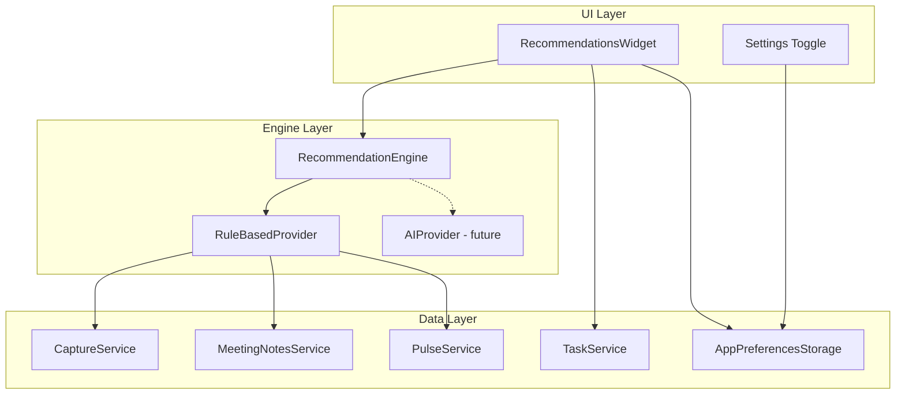
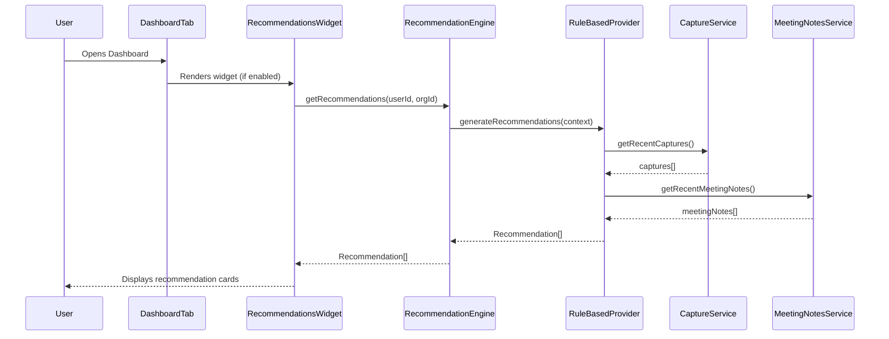
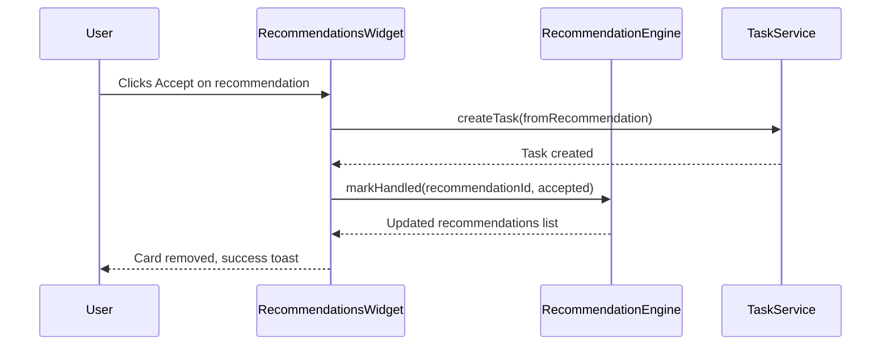
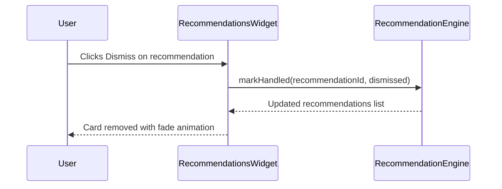

# Design Document: Task Recommendations

## Overview

The Task Recommendations feature introduces a rule-based recommendation engine that analyzes user context (captured items, meeting notes, calendar events, and pulse data) to generate actionable task suggestions. Recommendations surface on the Dashboard tab as a dismissible widget. Users can accept a recommendation (converting it into a real task) or dismiss it. A toggle in the App Preferences screen controls whether recommendations are enabled (default: enabled). The architecture is designed with a provider abstraction so the initial rule-based engine can later be swapped for an AI/LLM-powered provider without changing the UI or storage layers.

## Architecture



## Sequence Diagrams

### Generating Recommendations



### Accepting a Recommendation



### Dismissing a Recommendation


## Components and Interfaces

### Component 1: RecommendationEngine

**Purpose**: Orchestrates recommendation generation by delegating to a provider and managing recommendation lifecycle (generate, accept, dismiss).

**Interface**:
```typescript
interface RecommendationEngine {
  getRecommendations(userId: string, orgId: string): Promise<Recommendation[]>;
  markHandled(recommendationId: string, action: 'accepted' | 'dismissed'): Promise<void>;
  refreshRecommendations(userId: string, orgId: string): Promise<Recommendation[]>;
}
```

**Responsibilities**:
- Delegates generation to the active provider
- Deduplicates recommendations against existing tasks
- Filters out previously dismissed recommendations within a cooldown window
- Caches results to avoid redundant computation on re-renders

### Component 2: RuleBasedProvider

**Purpose**: Implements the initial recommendation strategy using pattern-matching rules on captured content.

**Interface**:
```typescript
interface RecommendationProvider {
  generateRecommendations(context: RecommendationContext): Promise<Recommendation[]>;
}
```

**Responsibilities**:
- Scans recent captures for action-oriented language (e.g., "need to", "should", "follow up", "reminder")
- Extracts potential task titles from matched patterns
- Assigns a confidence score based on pattern strength
- Limits output to a configurable maximum count (default: 5)

### Component 3: RecommendationsWidget

**Purpose**: Dashboard UI component that displays recommendation cards with accept/dismiss actions.

**Interface**:
```typescript
interface RecommendationsWidgetProps {
  userId: string;
  organizationId: string;
}
```

**Responsibilities**:
- Fetches recommendations on mount (respecting the enabled preference)
- Renders each recommendation as a card with title, source context, and action buttons
- Handles accept (creates task) and dismiss (removes card) interactions
- Shows empty state when no recommendations available
- Respects the `taskRecommendationsEnabled` preference

### Component 4: Settings Toggle

**Purpose**: Toggle in AppPreferences to enable/disable task recommendations.

**Responsibilities**:
- Renders a switch control following the existing AppPreferences pattern
- Persists the `taskRecommendationsEnabled` preference via `appPreferencesStorage`
- Default value: `true` (enabled)

## Data Models

### Recommendation

```typescript
interface Recommendation {
  id: string;
  title: string;
  description?: string;
  sourceType: RecommendationSource;
  sourceId: string;
  sourceExcerpt: string;
  confidence: number; // 0.0 - 1.0
  suggestedPriority: TaskPriority;
  createdAt: string;
}

type RecommendationSource = 'capture' | 'meeting_note' | 'calendar_event' | 'pulse';
```

**Validation Rules**:
- `id` must be a valid UUID
- `title` must be non-empty and at most 200 characters
- `confidence` must be between 0.0 and 1.0 inclusive
- `sourceType` must be one of the defined enum values
- `sourceId` must reference a valid existing entity
- `createdAt` must be a valid ISO 8601 timestamp

### RecommendationContext

```typescript
interface RecommendationContext {
  userId: string;
  organizationId: string;
  recentCaptures: Capture[];
  recentMeetingNotes: MeetingNote[];
  existingTaskTitles: string[];
  dismissedRecommendationIds: string[];
  maxResults: number;
}
```

### HandledRecommendation

```typescript
interface HandledRecommendation {
  recommendationId: string;
  action: 'accepted' | 'dismissed';
  handledAt: string;
}
```

### Extended AppPreferencesData

```typescript
interface AppPreferencesData {
  theme: 'light' | 'dark' | 'system';
  defaultTab: string;
  compactMode: boolean;
  taskRecommendationsEnabled: boolean; // NEW - default: true
}
```
## Error Handling

### Error Scenario 1: Data Fetch Failure

**Condition**: Recommendation engine fails to load captures or meeting notes from Supabase
**Response**: Widget displays a non-intrusive "Unable to load suggestions" message with a retry button
**Recovery**: User taps retry, or recommendations refresh on next dashboard visit

### Error Scenario 2: Task Creation Failure

**Condition**: Accepting a recommendation fails when creating the task via Supabase
**Response**: Show error toast and keep the recommendation card visible
**Recovery**: User can retry the accept action; recommendation is not marked as handled

### Error Scenario 3: No Context Available

**Condition**: User has no captures, meeting notes, or pulse data to analyze
**Response**: Widget shows a friendly empty state: "Start capturing notes to get task suggestions"
**Recovery**: Recommendations appear automatically once context data exists

### Error Scenario 4: Provider Timeout

**Condition**: Rule-based provider takes longer than 5 seconds to process
**Response**: Engine cancels the request, widget shows cached recommendations if available or empty state
**Recovery**: Next dashboard visit triggers fresh generation

## Testing Strategy

### Unit Testing Approach

- Test `RuleBasedProvider` pattern matching with known inputs (action phrases, non-action text)
- Test `RecommendationEngine` deduplication logic against existing task titles
- Test `RecommendationEngine` dismiss cooldown filtering
- Test confidence scoring boundary values
- Test `AppPreferencesStorage` with the new `taskRecommendationsEnabled` field

### Property-Based Testing Approach

- Property tests validate universal invariants of the recommendation engine
- Use `fast-check` library for TypeScript property-based testing

**Property Test Library**: fast-check

### Integration Testing Approach

- Test that the widget correctly hides when preferences toggle is off
- Test accept flow end-to-end: recommendation to task creation to card removal
- Test dismiss flow: recommendation to dismiss to cooldown period

## Performance Considerations

- Recommendations are generated on dashboard load, not on every re-render (cached in state)
- Rule-based scanning limits input to the most recent 50 captures and 20 meeting notes
- Results are capped at 5 recommendations to avoid overwhelming the user
- Provider has a 5-second timeout to prevent blocking the dashboard render

## Security Considerations

- Recommendations only access data within the user's own organization
- No PII is transmitted externally (rule-based engine runs entirely client-side)
- The future AI provider hook must ensure data is sent only to approved endpoints with user consent

## Dependencies

- `@admini/shared` - Capture, Task, TaskPriority types
- `@admini/workspace` - AppPreferencesStorage, DashboardTab integration
- `@admini/api-client` - Supabase client for fetching captures and meeting notes
- `fast-check` - Property-based testing library (dev dependency)
## Correctness Properties

*A property is a characteristic or behavior that should hold true across all valid executions of a system-essentially, a formal statement about what the system should do. Properties serve as the bridge between human-readable specifications and machine-verifiable correctness guarantees.*

### Property 1: Pattern Matching Correctness

*For any* capture text containing one of the defined action phrases ("need to", "should", "follow up", "reminder", "action item", "todo", "dont forget"), the Rule_Based_Provider SHALL produce at least one recommendation. *For any* capture text containing none of these phrases, the provider SHALL produce zero recommendations from that capture.

**Validates: Requirements 1.2**

### Property 2: Recommendation Output Validity

*For any* recommendation produced by the Rule_Based_Provider, the title SHALL be a non-empty string of at most 200 characters derived from the source text, and the confidence score SHALL be a number in the range [0.0, 1.0] inclusive.

**Validates: Requirements 1.3, 1.4**

### Property 3: Result Count Cap

*For any* input context regardless of the number of matching captures and meeting notes, the Recommendation_Engine SHALL return at most 5 recommendations.

**Validates: Requirements 1.5**

### Property 4: Input Limiting

*For any* context containing more than 50 captures, only the 50 most recent (by createdAt) SHALL be processed. *For any* context containing more than 20 meeting notes, only the 20 most recent SHALL be processed. Adding older items beyond these limits SHALL not change the output.

**Validates: Requirements 1.6**

### Property 5: Deduplication Exclusion

*For any* set of existing task titles and candidate recommendations, if a candidate recommendation title closely matches an existing task title, that candidate SHALL be excluded from the final results.

**Validates: Requirements 2.2**

### Property 6: Dismiss Cooldown Filtering

*For any* previously dismissed recommendation, if the dismissal occurred within 7 days of the current generation time, that recommendation SHALL be excluded from results. If the dismissal occurred more than 7 days ago, the recommendation MAY reappear.

**Validates: Requirements 2.3**

### Property 7: Accept Creates Matching Task

*For any* recommendation that is accepted, the resulting task SHALL have a title equal to the recommendation title and a priority equal to the recommendation's suggested priority.

**Validates: Requirements 4.1**