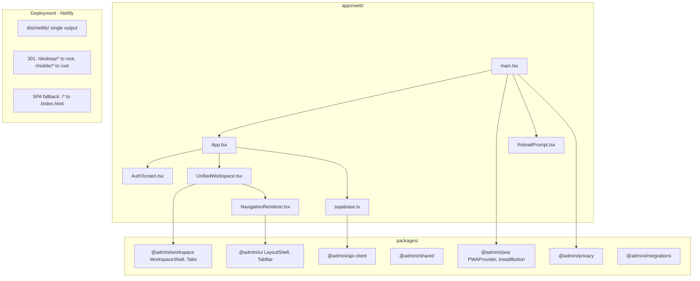
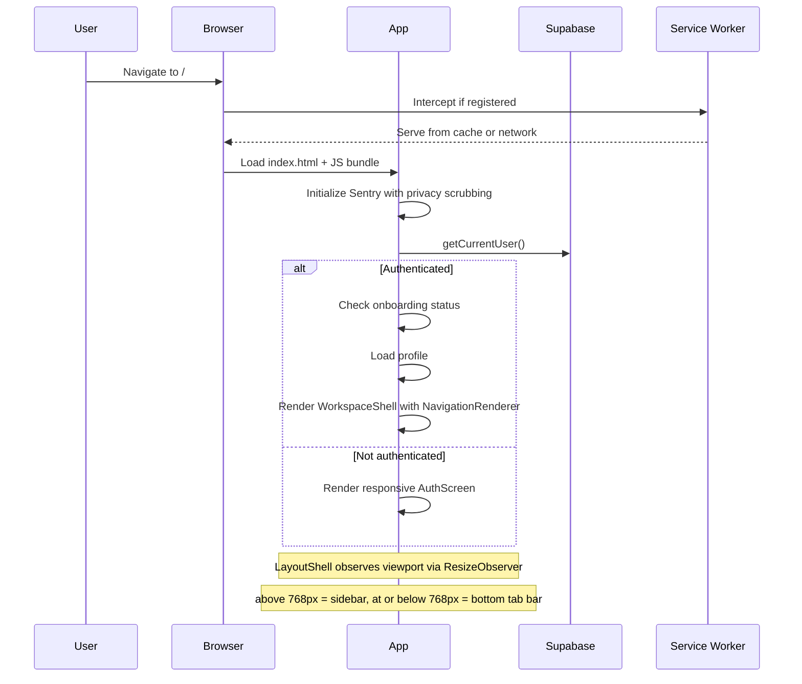

# Design Document: Unified Responsive PWA

## Overview

This design merges the two separate AdminI applications (`@admini/desktop` and `@admini/mobile`) into a single Vite+React application located at `apps/web/`. The unified app serves from the root path `/` and adapts its layout between desktop (sidebar navigation) and mobile (bottom tab bar) using the existing `LayoutShell` component from `@admini/ui`, which performs viewport-based layout switching via `ResizeObserver` at the 768px breakpoint.

The architecture leverages a **render-prop navigation pattern** already established in the codebase: `WorkspaceShell` accepts a `renderNavigation` prop that receives the current layout mode alongside tab state. The unified app passes a single navigation renderer that conditionally returns either a `DesktopSidebar` or a `TabBar` based on the layout mode provided by `LayoutShell`.

Key design decisions:
- **No shared package modifications** - the unified app consumes `@admini/ui`, `@admini/workspace`, `@admini/pwa`, and all other packages as-is
- **Single Supabase client** - one instance created at app startup, shared through `SupabaseClientProvider`
- **Single VitePWA configuration** - one manifest, one service worker, one install experience
- **Legacy path redirects** - Netlify 301s from `/desktop/*` and `/mobile/*` to equivalent root paths
- **Auth screen unification** - both apps share nearly identical auth screen code; the unified app uses a single responsive implementation with a CSS media query to switch between split-panel (desktop) and stacked (mobile) layouts

## Architecture



### Application Flow



## Components and Interfaces

### 1. Entry Point (`apps/web/src/main.tsx`)

Initializes Sentry with `@admini/privacy` scrubbing, wraps the app in `PWAProvider`, and renders `App` + `ReloadPrompt`.

```typescript
Sentry.init({
  dsn: import.meta.env.VITE_SENTRY_DSN,
  environment: import.meta.env.VITE_SENTRY_ENVIRONMENT ?? 'preview',
  release: 'admini-web@0.1.0',
  beforeSend(event) {
    if (event.message) event.message = scrubSentryText(event.message);
    return event;
  }
});

// Render tree:
// <PWAProvider>
//   <App />
//   <ReloadPrompt />
// </PWAProvider>
```

### 2. App Component (`apps/web/src/App.tsx`)

Unifies the auth/session management logic from both legacy apps into a single component. The logic is functionally identical between desktop and mobile - the unified version consolidates them.

**Responsibilities:**
- Session initialization (getCurrentUser, auth state listener, visibility change re-validation)
- Invitation token handling (URL parse, sessionStorage persistence, acceptInvitation call)
- Onboarding wizard orchestration
- Profile loading and role detection
- Renders either `AuthScreen` (unauthenticated) or `UnifiedWorkspace` (authenticated + onboarded)

### 3. Navigation Renderer (`apps/web/src/components/NavigationRenderer.tsx`)

A single component that receives `NavigationAdapterProps` plus a `layoutMode` from `LayoutShell` and renders the appropriate navigation UI:

```typescript
import type { NavigationAdapterProps } from '@admini/workspace';
import type { LayoutMode } from '@admini/ui';
import { TabBar } from '@admini/ui';
import { DesktopSidebar } from './DesktopSidebar';

interface NavigationRendererProps extends NavigationAdapterProps {
  layoutMode: LayoutMode;
}

export function NavigationRenderer({ layoutMode, activeTab, tabs, onTabChange }: NavigationRendererProps) {
  if (layoutMode === 'desktop') {
    return <DesktopSidebar activeTab={activeTab} tabs={tabs} onTabChange={onTabChange} />;
  }
  return <TabBar tabs={tabs} activeTab={activeTab} onTabChange={onTabChange as (tabId: string) => void} />;
}
```

### 4. Unified Workspace (`apps/web/src/UnifiedWorkspace.tsx`)

Wraps `WorkspaceShell` inside `SupabaseClientProvider`. Passes the responsive navigation renderer that adapts between sidebar and tab bar based on the layout mode detected by `LayoutShell`.

```typescript
export function UnifiedWorkspace(props: UnifiedWorkspaceProps) {
  return (
    <SupabaseClientProvider client={supabase!}>
      <WorkspaceShell
        {...props}
        renderNavigation={({ activeTab, tabs, onTabChange }) => (
          <NavigationRenderer
            layoutMode={/* provided by LayoutShell internally */}
            activeTab={activeTab}
            tabs={tabs}
            onTabChange={onTabChange}
          />
        )}
      />
      <InstallButton />
    </SupabaseClientProvider>
  );
}
```

The `LayoutShell` inside `WorkspaceShell` already handles mode detection via `ResizeObserver`. The `renderNavigation` prop receives `layoutMode` from `LayoutShell` internally.

### 5. Responsive Auth Screens (`apps/web/src/AuthScreen.tsx`)

The auth screens (home, sign-in, sign-up) are extracted into their own module. Layout adaptation uses CSS media queries:

```css
/* Desktop: split-panel layout */
@media (min-width: 769px) {
  .split-auth {
    display: grid;
    grid-template-columns: 1fr 1fr;
  }
  .auth-story { display: flex; }
}

/* Mobile: stacked layout */
@media (max-width: 768px) {
  .split-auth {
    display: flex;
    flex-direction: column;
  }
  .auth-story { display: none; }
}
```

The desktop auth screen already uses a `split-auth` layout with an `AuthStoryPanel` alongside the form. On mobile, the story panel is hidden and the form stacks vertically optimized for touch.

### 6. Legacy Service Worker Cleanup

Static HTML stubs at `public/desktop/index.html` and `public/mobile/index.html` that unregister legacy service workers before redirecting:

```html
<!DOCTYPE html>
<html lang="en">
<head><meta charset="utf-8"><title>Redirecting...</title></head>
<body>
<script>
if ('serviceWorker' in navigator) {
  navigator.serviceWorker.getRegistrations().then(function(registrations) {
    registrations.forEach(function(reg) {
      if (reg.scope.includes('/desktop/') || reg.scope.includes('/mobile/')) {
        reg.unregister();
      }
    });
  });
}
window.location.replace('/');
</script>
<noscript><meta http-equiv="refresh" content="0;url=/"></noscript>
</body>
</html>
```

### 7. Vite Configuration (`apps/web/vite.config.ts`)

```typescript
import { fileURLToPath, URL } from 'node:url';
import react from '@vitejs/plugin-react';
import { defineConfig } from 'vite';
import { VitePWA } from 'vite-plugin-pwa';

export default defineConfig({
  base: '/',
  envDir: fileURLToPath(new URL('../..', import.meta.url)),
  plugins: [
    react(),
    VitePWA({
      strategies: 'generateSW',
      registerType: 'prompt',
      workbox: {
        globPatterns: ['**/*.{js,css,html,ico,png,svg,woff2}'],
        navigateFallback: '/offline.html',
        navigateFallbackDenylist: [/^\/api\//]
      },
      manifest: {
        name: 'AdminI',
        short_name: 'AdminI',
        display: 'standalone',
        start_url: '/',
        scope: '/',
        theme_color: '#1a1a2e',
        background_color: '#f7f8fa',
        icons: [
          { src: '/icons/icon-192x192.png', sizes: '192x192', type: 'image/png', purpose: 'any maskable' },
          { src: '/icons/icon-512x512.png', sizes: '512x512', type: 'image/png', purpose: 'any maskable' }
        ]
      }
    })
  ],
  resolve: {
    alias: {
      '@admini/ui/styles.css': fileURLToPath(new URL('../../packages/ui/src/styles.css', import.meta.url)),
      '@admini/shared': fileURLToPath(new URL('../../packages/shared/src/index.ts', import.meta.url)),
      '@admini/privacy': fileURLToPath(new URL('../../packages/privacy/src/index.ts', import.meta.url)),
      '@admini/api-client': fileURLToPath(new URL('../../packages/api-client/src/index.ts', import.meta.url)),
      '@admini/ui': fileURLToPath(new URL('../../packages/ui/src/index.ts', import.meta.url)),
      '@admini/integrations': fileURLToPath(new URL('../../packages/integrations/src/index.ts', import.meta.url)),
      '@admini/workspace': fileURLToPath(new URL('../../packages/workspace/src/index.ts', import.meta.url)),
      '@admini/pwa': fileURLToPath(new URL('../../packages/pwa/src/index.ts', import.meta.url))
    }
  }
});
```

### 8. Netlify Configuration (`netlify.toml`)

```toml
[build]
command = "npm run build:app"
publish = "dist/netlify"

[build.environment]
NODE_VERSION = "20"

# Legacy path redirects (processed in order, before SPA fallback)
[[redirects]]
from = "/desktop"
to = "/"
status = 301

[[redirects]]
from = "/desktop/*"
to = "/:splat"
status = 301

[[redirects]]
from = "/mobile"
to = "/"
status = 301

[[redirects]]
from = "/mobile/*"
to = "/:splat"
status = 301

# SPA fallback (must be last)
[[redirects]]
from = "/*"
to = "/index.html"
status = 200

[[headers]]
for = "/*"
[headers.values]
  X-Content-Type-Options = "nosniff"
  Referrer-Policy = "strict-origin-when-cross-origin"
  Permissions-Policy = "camera=(), microphone=(self), geolocation=()"

[[headers]]
for = "/sw.js"
[headers.values]
  Cache-Control = "no-cache"
  Content-Type = "application/javascript"

[[headers]]
for = "/manifest.webmanifest"
[headers.values]
  Content-Type = "application/manifest+json"
```

### 9. Offline Fallback (`apps/web/public/offline.html`)

A static HTML page served by the service worker when a navigation request fails while offline:

```html
<!DOCTYPE html>
<html lang="en">
<head>
  <meta charset="utf-8">
  <meta name="viewport" content="width=device-width, initial-scale=1">
  <title>AdminI - Offline</title>
</head>
<body>
  <main role="main" aria-label="Offline notice">
    <h1>You are offline</h1>
    <p>AdminI needs an internet connection to load new pages.</p>
    <button type="button" aria-label="Retry loading the page" onclick="window.location.reload()">
      Retry
    </button>
  </main>
</body>
</html>
```

## Data Models

No new data models are introduced. The unified app consumes the same Supabase schema (profiles, organizations, organization_memberships, tasks, etc.) through the existing `@admini/api-client` and `@admini/workspace` services.

### State Shape (App-Level)

The unified `App` component manages the same React state as both legacy apps:

| State Field | Type | Purpose |
|---|---|---|
| `user` | `AuthUser \| null` | Current authenticated user |
| `loadingUser` | `boolean` | Initial session check in progress |
| `onboardingComplete` | `boolean \| null` | Whether onboarding wizard is done |
| `onboardingAnswers` | `OnboardingAnswers \| null` | Cached wizard responses |
| `userRole` | `string` | Role from organization_memberships |
| `profileLoaded` | `boolean` | Profile fetch complete |
| `organizationId` | `string \| undefined` | Current org context |
| `invitationToken` | `string \| null` | Pending invitation token |
| `invitationError` | `string \| null` | Invitation acceptance error |

### Configuration

| Config | Value | Source |
|---|---|---|
| `VITE_SUPABASE_URL` | Supabase project URL | `.env.local` |
| `VITE_SUPABASE_ANON_KEY` | Supabase anon key | `.env.local` |
| `VITE_SENTRY_DSN` | Sentry DSN | `.env.local` |
| `VITE_SENTRY_ENVIRONMENT` | preview or production | `.env.local` |
| OAuth redirect URL | Root origin | Supabase dashboard |

## Error Handling

### Authentication Errors

| Scenario | Handling |
|---|---|
| OAuth redirect fails | Display inline error message in auth screen, allow retry |
| Token refresh fails (SIGNED_OUT event) | Clear user state, redirect to auth screen |
| Session expired on visibility change | Re-validate session, redirect to auth if invalid |
| Invitation token invalid/expired | Show dismissible error banner, clear token from sessionStorage |
| Supabase not configured | Show contextual error message suggesting restart |

### Service Worker Errors

| Scenario | Handling |
|---|---|
| SW registration fails | App continues without offline support, no user-visible error |
| SW update available | `ReloadPrompt` banner appears with Reload/Dismiss options |
| Offline navigation to uncached page | Service worker serves `/offline.html` fallback |
| SW crashes or fails to load | App detects offline via `Navigator.onLine` API, shows inline indicator |
| Legacy SW at old scope | Cleanup script unregisters it on visit to legacy path |

### Network Errors

| Scenario | Handling |
|---|---|
| Profile fetch fails | Default role applied (`admin`), profileLoaded set true to avoid blocking |
| Organization details fetch fails | Falls back to auth metadata for school name |
| Onboarding status check fails | Treats as incomplete, re-shows wizard |

### Layout Errors

| Scenario | Handling |
|---|---|
| LayoutShell ResizeObserver not supported | Falls back to mobile layout (default state) |
| Content lazy-load fails | `ContentErrorBoundary` in LayoutShell shows retry button |
| Suspense timeout | Skeleton cards shown until content resolves |

## Correctness Properties

*A property is a characteristic or behavior that should hold true across all valid executions of a system-essentially, a formal statement about what the system should do. Properties serve as the bridge between human-readable specifications and machine-verifiable correctness guarantees.*

### Assessment: Property-Based Testing Does Not Apply

After analyzing all 11 requirements and their 40+ acceptance criteria, no criteria qualify as PROPERTY-type tests suitable for property-based testing. The classifications break down as:

- **SMOKE** (22 criteria) - Configuration and structure checks (Vite config, Netlify headers, package.json scripts, manifest fields, file existence)
- **EXAMPLE** (13 criteria) - Specific scenario verifications (layout at given viewport, auth flow steps, feature presence checks)
- **INTEGRATION** (5 criteria) - External service wiring (OAuth flow, service worker behavior, Netlify redirects)
- **EDGE_CASE** (1 criterion) - Fallback behavior when service worker fails

**Why PBT is inappropriate for this feature:**

1. **No pure functions with rich input spaces** - The feature consolidates two existing apps into one. The new code is primarily component composition (NavigationRenderer, UnifiedWorkspace, AuthScreen) where behavior is determined by a single enum value (`layoutMode: 'desktop' | 'mobile'`), not a large input space.

2. **Configuration-driven correctness** - Most acceptance criteria verify that configuration values are set correctly (Vite `base: '/'`, manifest `start_url`, Netlify redirect rules). These are snapshot-testable, not property-testable.

3. **UI layout is viewport-deterministic** - The layout switching at 768px is a binary condition, not a function over a continuous domain. Testing at specific breakpoints (example-based) fully covers the behavior.

4. **No serialization, parsing, or data transformation** - The unified app consumes existing data models and API clients unchanged. There are no new encode/decode paths or business logic transformations.

5. **Infrastructure wiring** - Service worker registration, offline fallback serving, and OAuth redirects are integration concerns best verified by end-to-end tests with 1-2 representative scenarios.

### Verifiable Correctness Guarantees (Non-PBT)

While not suitable for property-based testing, the following correctness guarantees are formalized as verifiable assertions:

### Property 1: Layout mode is a pure function of viewport width
For any viewport width W: if W > 768 then layoutMode = 'desktop'; if W <= 768 then layoutMode = 'mobile'. No other state influences this determination.
*Validated by: Example-based tests at boundary values (767px, 768px, 769px)*
**Validates: Requirements 2.1, 2.2**

### Property 2: NavigationRenderer output is determined solely by layoutMode prop
For layoutMode = 'desktop', NavigationRenderer always renders DesktopSidebar. For layoutMode = 'mobile', NavigationRenderer always renders TabBar. No side effects, no conditional logic beyond the mode check.
*Validated by: Unit tests with both mode values*
**Validates: Requirements 2.1, 2.2, 2.3**

### Property 3: Legacy path redirect preserves subpath
For any path suffix S: `/desktop/S` redirects to `/S` and `/mobile/S` redirects to `/S`, both with HTTP 301 status.
*Validated by: Integration tests with representative paths*
**Validates: Requirements 7.1, 7.2**

### Property 4: Build produces exactly one deployable output
The `build:app` command produces a single directory (`dist/netlify/`) containing one `index.html`, one `sw.js`, and one `manifest.webmanifest`.
*Validated by: Build output inspection in CI*
**Validates: Requirements 1.1, 3.1, 3.2, 4.1**

### Property 5: Shared packages remain unmodified
Zero source file changes in `packages/ui/`, `packages/workspace/`, `packages/pwa/`, `packages/shared/`, `packages/api-client/`, `packages/privacy/`, `packages/integrations/`.
*Validated by: Git diff check in CI*
**Validates: Requirements 8.1, 8.2, 8.3, 8.4**

### Property 6: Offline fallback is served when navigation fails
When the service worker intercepts a navigation request that fails (network unavailable, page not cached), it responds with the contents of `/offline.html`.
*Validated by: Integration test: register SW, go offline, navigate, assert offline.html content*
**Validates: Requirements 9.1, 9.2**

## Testing Strategy

### Why Property-Based Testing Does Not Apply

This feature is primarily a consolidation of two existing applications into one, involving:
- **Configuration** (Vite, Netlify, PWA manifest) - validated by snapshot tests and build verification
- **UI layout switching** - validated by visual regression and integration tests
- **Infrastructure wiring** (service workers, redirects) - validated by integration tests
- **Code merging** - validated by existing unit tests in shared packages

There are no pure functions with rich input spaces, no parsers/serializers, and no business logic transformations being introduced. The core correctness concern is "does the unified app render the same UI as the two legacy apps?" which is best verified by example-based integration tests and visual comparison.

### Unit Tests

Focus on the new `NavigationRenderer` component and auth screen layout logic:

| Test | Approach |
|---|---|
| NavigationRenderer renders DesktopSidebar when layoutMode is 'desktop' | Render with mode='desktop', assert sidebar markup present |
| NavigationRenderer renders TabBar when layoutMode is 'mobile' | Render with mode='mobile', assert tab bar markup present |
| Auth screen shows split-panel on desktop viewport | Render at 800px width, assert grid layout class |
| Auth screen shows stacked layout on mobile viewport | Render at 375px width, assert flex-column class |
| Auth screen transitions without page reload on resize | Resize viewport, assert layout change without unmount |
| Invitation token parsed from URL and stored in sessionStorage | Set search params, mount App, verify storage |
| Legacy SW cleanup script unregisters matching registrations | Mock navigator.serviceWorker, verify unregister called |

### Integration Tests

| Test | Approach |
|---|---|
| Full auth flow (sign-in, onboarding, workspace render) | E2E test with Supabase mock |
| PWA manifest served correctly at `/manifest.webmanifest` | Build app, serve, fetch manifest, validate fields |
| Service worker precaches assets | Build, check sw.js output includes expected glob patterns |
| Offline fallback page served for uncached navigation | Register SW, go offline, navigate, assert offline.html content |
| Legacy redirects work (301 from /desktop/* to /*) | Deploy or mock Netlify, verify redirect response |
| Build produces single output directory | Run build:app, verify dist/netlify contains single app |

### Smoke Tests

| Test | Approach |
|---|---|
| `npm run build:app` succeeds without errors | CI pipeline check |
| `npm run dev` starts Vite dev server at localhost root path | Manual verification |
| TypeScript compilation passes | `tsc --noEmit` in CI |
| All shared package imports resolve | Build verification |

### Test Tools

- **Vitest** - unit and integration tests (already used in `@admini/mobile` and packages)
- **@testing-library/react** - component rendering tests
- **jsdom** - DOM environment for unit tests
- **Playwright** (future) - E2E browser tests for PWA install flow and offline behavior
